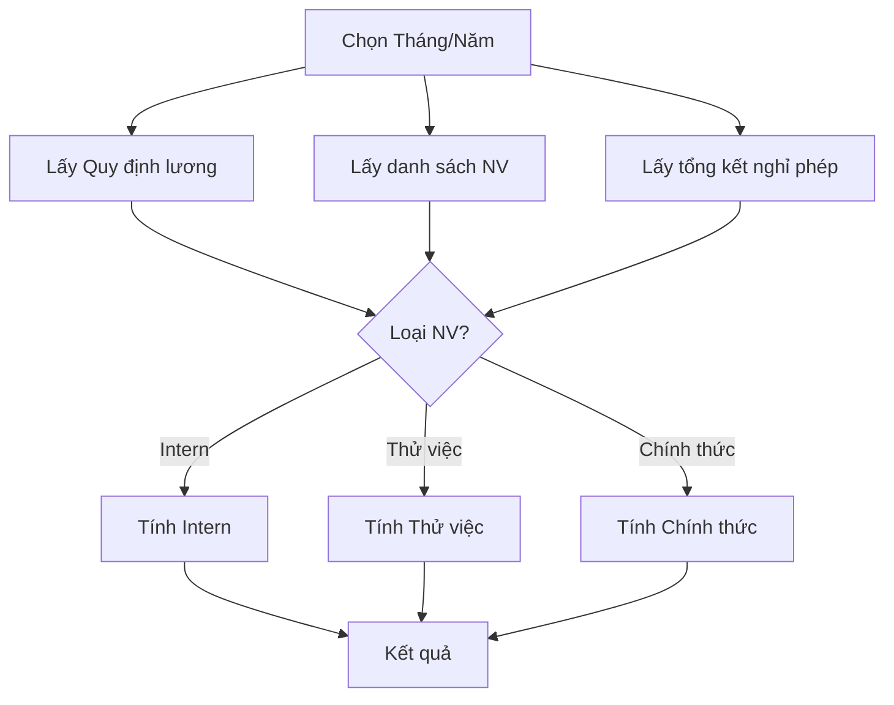

# Công thức & Cách tính lương HRM — Chi tiết

## Tổng quan Flow



---

## Dữ liệu đầu vào

### Từ Quy định lương (`salary_regulations`)

| Tham số | Mặc định | Mô tả |
|---------|----------|-------|
| `working_days_per_month` | 22 | Số ngày công chuẩn/tháng |
| `working_hours_per_day` | 8 | Số giờ/ngày |
| `overtime_weekday_rate` | 150% | Hệ số OT ngày thường |
| `overtime_weekend_rate` | 200% | Hệ số OT cuối tuần |
| `max_insurance_salary` | = lương cơ bản | Mức trần đóng BHXH/BHYT |
| `max_unemployment_salary` | = lương cơ bản | Mức trần đóng BH thất nghiệp |
| `personal_deduction` | 11,000,000 | Giảm trừ bản thân |
| `dependent_deduction` | 4,400,000 | Giảm trừ mỗi người phụ thuộc |
| `enable_progressive_tax` | true | Dùng thuế lũy tiến (false = flat 10%) |

### Tỷ lệ bảo hiểm

| Loại | NV đóng | Công ty đóng |
|------|---------|-------------|
| BHXH | 8% | 17.5% |
| BHYT | 1.5% | 3% |
| BH Thất nghiệp | 1% | 1% |
| Công đoàn | 1% | — |

### Từ dữ liệu NV

- `basicSalary` — Lương cơ bản hợp đồng
- `presentDays` — Ngày đi làm thực tế (từ attendance)
- `weekdayOvertimeHours` / `weekendOvertimeHours` — Giờ OT
- `meal_allowance`, `transport_allowance`, `phone_allowance`, `attendance_allowance`, `clothing_allowance`, `overtime_allowance` — Phụ cấp
- `dependents` — Số người phụ thuộc
- `paidLeaveDays` — Ngày nghỉ phép có lương

---

## Công thức chung

### Bước 1: Tổng ngày được trả lương

```
totalPaidDays = presentDays + paidLeaveDays
attendanceRatio = totalPaidDays / workingDaysPerMonth
```

### Bước 2: Lương cơ bản thực nhận

```
standardDailyRate = basicSalary / workingDaysPerMonth
actualBasicSalary = basicSalary × (totalPaidDays / workingDaysPerMonth)
```

### Bước 3: Phụ cấp (theo tỷ lệ đi làm)

```
employeeAllowancesTotal = meal + transport + phone + attendance + clothing + overtime_allowance
adjustedEmployeeAllowances = employeeAllowancesTotal × attendanceRatio
totalAllowances = adjustedEmployeeAllowances + formAllowances (nếu có)
```

### Bước 4: Tăng ca

```
weekdayOvertimeDays = weekdayOvertimeHours / workingHoursPerDay
weekendOvertimeDays = weekendOvertimeHours / workingHoursPerDay

weekdayOvertimeMultiplier = (overtimeWeekdayRate - 100) / 100   → ví dụ: (150-100)/100 = 0.5
weekendOvertimeMultiplier = (overtimeWeekendRate - 100) / 100   → ví dụ: (200-100)/100 = 1.0

weekdayOvertimePay = weekdayOvertimeDays × standardDailyRate × weekdayOvertimeMultiplier
weekendOvertimePay = weekendOvertimeDays × standardDailyRate × weekendOvertimeMultiplier
totalOvertimePay = weekdayOvertimePay + weekendOvertimePay
```

> [!IMPORTANT]
> `totalOvertimePay` chỉ tính phần **chênh lệch** (premium), không tính phần lương cơ bản đã được tính ở bước 2. Ví dụ: OT 150% → chỉ tính 50% phần thêm.

### Bước 5: Tổng thu nhập (Gross)

```
grossSalary = actualBasicSalary + totalAllowances + totalOvertimePay + totalBonuses
```

---

## 3 loại nhân viên — Công thức khác nhau

### 🟡 Intern (Thực tập sinh)

Nhận dạng: `position` chứa "intern"

| Bước | Công thức |
|------|-----------|
| Lương cơ bản | `basicSalary × (presentDays / workingDaysPerMonth)` ⚠️ không cộng paidLeave |
| Bảo hiểm | **Không đóng** (= 0) |
| Giảm trừ | **Không có** giảm trừ bản thân/người phụ thuộc |
| Thuế TNCN | **Flat 10%** trên toàn bộ gross |
| Net | `gross - (gross × 10%)` |

### 🟠 Thử việc (Probation)

Nhận dạng: `position` chứa "thử việc"

| Bước | Công thức |
|------|-----------|
| Lương cơ bản | `basicSalary × **0.85** × (totalPaidDays / workingDaysPerMonth)` |
| OT | Tính trên `basicSalary × 0.85` (không phải full salary) |
| Bảo hiểm | **Không đóng** (= 0) |
| Giảm trừ | **Không có** giảm trừ |
| Thuế TNCN | **Flat 10%** trên toàn bộ gross |
| Net | `gross - (gross × 10%)` |

### 🟢 NV Chính thức (Regular)

| Bước | Công thức |
|------|-----------|
| Lương cơ bản | `basicSalary × (totalPaidDays / workingDaysPerMonth)` |
| Bảo hiểm NV | `min(basicSalary, maxInsuranceSalary) × (8% + 1.5% + 1%)` + công đoàn 1% |
| Gross | `actualBasic + allowances + OT + bonuses` |
| Thu nhập sau BH | `grossSalary - totalInsuranceDeductions` |
| Thu nhập tính thuế | `incomeAfterInsurance - actualMealAllowance - taxExemptOvertimePay` |
| Giảm trừ | `personalDeduction + (dependents × dependentDeduction)` |
| Thu nhập chịu thuế | `max(0, incomeForTax - totalPersonalDeductions)` |
| Thuế TNCN | Thuế lũy tiến 7 bậc (hoặc flat 10% nếu tắt progressive) |
| Net | `gross - insuranceDeductions - incomeTax` |

---

## Bảng thuế lũy tiến (7 bậc)

| Bậc | Thu nhập chịu thuế (VNĐ) | Thuế suất |
|-----|--------------------------|-----------|
| 1 | 0 → 5,000,000 | 5% |
| 2 | 5,000,001 → 10,000,000 | 10% |
| 3 | 10,000,001 → 18,000,000 | 15% |
| 4 | 18,000,001 → 32,000,000 | 20% |
| 5 | 32,000,001 → 52,000,000 | 25% |
| 6 | 52,000,001 → 80,000,000 | 30% |
| 7 | > 80,000,000 | 35% |

---

## Các khoản miễn thuế

| Khoản | Chi tiết |
|-------|---------|
| Phụ cấp ăn trưa (`actualMealAllowance`) | Tính theo tỷ lệ đi làm, trừ ra khỏi thu nhập tính thuế |
| Phần chênh lệch OT (`taxExemptOvertimePay`) | = `totalOvertimePay` (phần premium). Vì `totalOvertimePay` đã chỉ tính phần extra (50% hoặc 100%), toàn bộ đều miễn thuế |

```
incomeForTax = incomeAfterInsurance - actualMealAllowance - taxExemptOvertimePay
```

---

## Ví dụ tính lương NV chính thức

> Giả sử: Lương cơ bản = 15,000,000 | Đi làm 20/22 ngày | 1 ngày phép có lương | OT 8h ngày thường | Phụ cấp ăn = 730,000 | 1 người phụ thuộc

```
1. totalPaidDays = 20 + 1 = 21
   attendanceRatio = 21 / 22 = 0.9545

2. actualBasicSalary = 15,000,000 × (21/22) = 14,318,182

3. standardDailyRate = 15,000,000 / 22 = 681,818
   OT days = 8h / 8h = 1 day
   weekdayOvertimePay = 1 × 681,818 × 0.5 = 340,909

4. adjustedMeal = 730,000 × 0.9545 = 696,818
   totalAllowances = 696,818

5. grossSalary = 14,318,182 + 696,818 + 340,909 = 15,355,909

6. insuranceBase = min(15,000,000, maxInsurance) = 15,000,000
   BHXH = 15,000,000 × 8% = 1,200,000
   BHYT = 15,000,000 × 1.5% = 225,000
   BHTN = 15,000,000 × 1% = 150,000
   Công đoàn = 15,000,000 × 1% = 150,000
   totalInsurance = 1,725,000

7. incomeAfterInsurance = 15,355,909 - 1,725,000 = 13,630,909

8. actualMealAllowance = 696,818
   taxExemptOT = 340,909
   incomeForTax = 13,630,909 - 696,818 - 340,909 = 12,593,182

9. personalDeduction = 11,000,000
   dependentDeduction = 1 × 4,400,000 = 4,400,000
   totalDeductions = 15,400,000

10. taxableIncome = max(0, 12,593,182 - 15,400,000) = 0
    incomeTax = 0

11. netSalary = 15,355,909 - 1,725,000 - 0 = 13,630,909
```

---

## Source code

- Hằng số & hàm thuế: [payroll-logic.ts](file:///e:/TDC_App/TDGAMES_App/HRM/source/lib/payroll-logic.ts)
- Logic tính lương chính: [calculate-payroll/page.tsx](file:///e:/TDC_App/TDGAMES_App/HRM/source/app/calculate-payroll/page.tsx#L152-L575) (`calculatePayroll()`)
- API service: [payroll-service.ts](file:///e:/TDC_App/TDGAMES_App/HRM/source/lib/services/payroll-service.ts)
