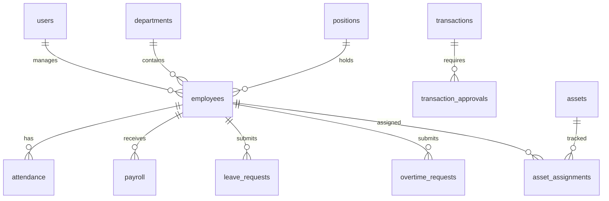

# HRM Application - Implementation Plan

## 📋 Overview

Xây dựng ứng dụng **Human Resource Management (HRM)** hoàn chỉnh với 5 modules chính:
1. **Quản lý hồ sơ nhân sự** - Employee Profile Management
2. **Chấm công, tính lương, bảng lương, phiếu lương** - Attendance & Payroll
3. **Quản lý nghỉ phép & tăng ca** - Leave & Overtime Management
4. **Quản lý thu/chi, duyệt thu-chi** - Income/Expense with Approval Workflow
5. **Quản lý tài sản** - Asset Management

---

## 🛠️ Proposed Tech Stack

### Backend (Supabase)
| Component | Technology | Rationale |
|-----------|------------|-----------|
| **Database** | PostgreSQL 17 | Already configured in Supabase HRM project |
| **Authentication** | Supabase Auth | Built-in, supports email/password, OAuth |
| **Authorization** | Row Level Security (RLS) | Granular access control at database level |
| **API** | Supabase Auto-generated REST + Real-time | Instant CRUD APIs |
| **Storage** | Supabase Storage | For employee documents, avatars, receipts |
| **Edge Functions** | Deno (TypeScript) | Complex business logic, payroll calculations |

### Frontend
| Component | Technology | Rationale |
|-----------|------------|-----------|
| **Framework** | Next.js 15 (App Router) | SSR, SEO, TypeScript support |
| **Language** | TypeScript | Type safety, better DX |
| **UI Library** | shadcn/ui + Tailwind CSS | Modern, accessible, customizable |
| **State Management** | TanStack Query | Server state, caching, mutations |
| **Forms** | React Hook Form + Zod | Validation, performance |
| **Charts** | Recharts | Dashboards, reports |
| **Date Handling** | date-fns | Lightweight date utilities |
| **Printing** | react-to-print | Payslips, reports |

### Project Structure
```
e:\TDC_App\Landing_Pages\hrm-app\
├── src/
│   ├── app/                    # Next.js App Router
│   │   ├── (auth)/             # Auth pages (login, register)
│   │   ├── (dashboard)/        # Protected pages
│   │   │   ├── employees/      # Employee management
│   │   │   ├── attendance/     # Attendance tracking
│   │   │   ├── payroll/        # Payroll & payslips
│   │   │   ├── leave/          # Leave management
│   │   │   ├── overtime/       # Overtime management
│   │   │   ├── finance/        # Income/Expense
│   │   │   └── assets/         # Asset management
│   │   └── api/                # API routes
│   ├── components/
│   │   ├── ui/                 # shadcn components
│   │   ├── forms/              # Form components
│   │   ├── tables/             # Data tables
│   │   └── layout/             # Layout components
│   ├── lib/
│   │   ├── supabase/           # Supabase client
│   │   ├── utils/              # Utilities
│   │   └── validations/        # Zod schemas
│   ├── hooks/                  # Custom hooks
│   └── types/                  # TypeScript types
├── supabase/
│   └── migrations/             # SQL migrations
└── public/                     # Static assets
```

---

## 🗄️ Database Schema Design

### Core Tables



---

### Module 1: Employee Profile Management

#### [NEW] `departments` table
Quản lý phòng ban trong tổ chức.

| Column | Type | Description |
|--------|------|-------------|
| id | uuid | Primary key |
| name | varchar(100) | Tên phòng ban |
| code | varchar(20) | Mã phòng ban |
| description | text | Mô tả |
| manager_id | uuid → employees | Trưởng phòng ban |
| parent_id | uuid → departments | Phòng ban cha (nếu có) |
| created_at | timestamptz | Ngày tạo |
| updated_at | timestamptz | Ngày cập nhật |

#### [NEW] `positions` table
Quản lý chức vụ.

| Column | Type | Description |
|--------|------|-------------|
| id | uuid | Primary key |
| name | varchar(100) | Tên chức vụ |
| code | varchar(20) | Mã chức vụ |
| level | integer | Cấp bậc (1-10) |
| description | text | Mô tả công việc |
| base_salary | decimal(15,2) | Lương cơ bản theo chức vụ |
| created_at | timestamptz | Ngày tạo |

#### [NEW] `employees` table
Thông tin nhân viên chi tiết.

| Column | Type | Description |
|--------|------|-------------|
| id | uuid | Primary key |
| user_id | uuid → auth.users | Liên kết tài khoản đăng nhập |
| employee_code | varchar(20) | Mã nhân viên (unique) |
| full_name | varchar(100) | Họ và tên |
| gender | enum | Nam/Nữ/Khác |
| date_of_birth | date | Ngày sinh |
| phone | varchar(20) | Số điện thoại |
| email | varchar(100) | Email cá nhân |
| address | text | Địa chỉ thường trú |
| id_card_number | varchar(20) | Số CCCD/CMND |
| id_card_issue_date | date | Ngày cấp |
| id_card_issue_place | varchar(100) | Nơi cấp |
| tax_code | varchar(20) | Mã số thuế |
| social_insurance_number | varchar(20) | Số BHXH |
| bank_account | varchar(30) | Số tài khoản ngân hàng |
| bank_name | varchar(100) | Tên ngân hàng |
| department_id | uuid → departments | Phòng ban |
| position_id | uuid → positions | Chức vụ |
| hire_date | date | Ngày vào làm |
| contract_type | enum | Thử việc/Có thời hạn/Không thời hạn |
| contract_end_date | date | Ngày hết hạn hợp đồng |
| base_salary | decimal(15,2) | Lương cơ bản |
| status | enum | Đang làm việc/Nghỉ việc/Tạm nghỉ |
| avatar_url | text | URL ảnh đại diện |
| notes | text | Ghi chú |
| created_at | timestamptz | Ngày tạo |
| updated_at | timestamptz | Ngày cập nhật |

#### [NEW] `employee_documents` table
Lưu trữ tài liệu nhân sự.

| Column | Type | Description |
|--------|------|-------------|
| id | uuid | Primary key |
| employee_id | uuid → employees | Nhân viên |
| document_type | enum | Hợp đồng/CCCD/Bằng cấp/Khác |
| document_name | varchar(200) | Tên tài liệu |
| file_url | text | URL file trong Storage |
| uploaded_at | timestamptz | Ngày upload |

---

### Module 2: Attendance & Payroll

#### [NEW] `attendance` table
Chấm công hàng ngày.

| Column | Type | Description |
|--------|------|-------------|
| id | uuid | Primary key |
| employee_id | uuid → employees | Nhân viên |
| work_date | date | Ngày làm việc |
| check_in | time | Giờ vào |
| check_out | time | Giờ ra |
| check_in_location | point | Vị trí GPS khi check-in |
| check_out_location | point | Vị trí GPS khi check-out |
| work_hours | decimal(4,2) | Số giờ làm việc |
| status | enum | Đúng giờ/Đi trễ/Về sớm/Vắng |
| notes | text | Ghi chú |
| created_at | timestamptz | Ngày tạo |

#### [NEW] `work_schedules` table
Lịch làm việc chuẩn.

| Column | Type | Description |
|--------|------|-------------|
| id | uuid | Primary key |
| name | varchar(50) | Tên ca làm việc |
| start_time | time | Giờ bắt đầu |
| end_time | time | Giờ kết thúc |
| break_minutes | integer | Phút nghỉ giữa ca |
| is_default | boolean | Ca mặc định |

#### [NEW] `payroll_periods` table
Kỳ tính lương.

| Column | Type | Description |
|--------|------|-------------|
| id | uuid | Primary key |
| name | varchar(50) | Tên kỳ lương (VD: Tháng 01/2026) |
| start_date | date | Ngày bắt đầu |
| end_date | date | Ngày kết thúc |
| status | enum | Đang mở/Đã khóa/Đã thanh toán |
| created_by | uuid → employees | Người tạo |
| closed_at | timestamptz | Ngày khóa kỳ lương |

#### [NEW] `payroll` table
Bảng lương chi tiết.

| Column | Type | Description |
|--------|------|-------------|
| id | uuid | Primary key |
| employee_id | uuid → employees | Nhân viên |
| period_id | uuid → payroll_periods | Kỳ lương |
| base_salary | decimal(15,2) | Lương cơ bản |
| work_days | decimal(4,1) | Số công tiêu chuẩn |
| actual_work_days | decimal(4,1) | Số công thực tế |
| overtime_hours | decimal(5,2) | Tổng giờ tăng ca |
| overtime_amount | decimal(15,2) | Tiền tăng ca |
| allowances | decimal(15,2) | Các khoản phụ cấp |
| bonuses | decimal(15,2) | Thưởng |
| deductions | decimal(15,2) | Các khoản khấu trừ |
| social_insurance | decimal(15,2) | BHXH (10.5%) |
| health_insurance | decimal(15,2) | BHYT (1.5%) |
| unemployment_insurance | decimal(15,2) | BHTN (1%) |
| personal_income_tax | decimal(15,2) | Thuế TNCN |
| gross_salary | decimal(15,2) | Tổng thu nhập |
| net_salary | decimal(15,2) | Lương thực nhận |
| payment_status | enum | Chờ thanh toán/Đã thanh toán |
| payment_date | date | Ngày thanh toán |
| notes | text | Ghi chú |
| created_at | timestamptz | Ngày tạo |

#### [NEW] `salary_components` table
Chi tiết các khoản lương.

| Column | Type | Description |
|--------|------|-------------|
| id | uuid | Primary key |
| payroll_id | uuid → payroll | Bảng lương |
| component_type | enum | Phụ cấp/Thưởng/Khấu trừ/Khác |
| component_name | varchar(100) | Tên khoản |
| amount | decimal(15,2) | Số tiền |
| description | text | Mô tả |

---

### Module 3: Leave & Overtime Management

#### [NEW] `leave_types` table
Loại nghỉ phép.

| Column | Type | Description |
|--------|------|-------------|
| id | uuid | Primary key |
| name | varchar(50) | Tên loại nghỉ |
| code | varchar(10) | Mã loại nghỉ |
| is_paid | boolean | Có lương không |
| max_days_per_year | integer | Số ngày tối đa/năm |
| color | varchar(7) | Màu hiển thị (#hex) |

#### [NEW] `leave_balances` table
Số ngày phép còn lại.

| Column | Type | Description |
|--------|------|-------------|
| id | uuid | Primary key |
| employee_id | uuid → employees | Nhân viên |
| leave_type_id | uuid → leave_types | Loại nghỉ phép |
| year | integer | Năm |
| total_days | decimal(4,1) | Tổng số ngày được phép |
| used_days | decimal(4,1) | Số ngày đã sử dụng |
| remaining_days | decimal(4,1) | Số ngày còn lại |

#### [NEW] `leave_requests` table
Đơn xin nghỉ phép.

| Column | Type | Description |
|--------|------|-------------|
| id | uuid | Primary key |
| employee_id | uuid → employees | Nhân viên |
| leave_type_id | uuid → leave_types | Loại nghỉ phép |
| start_date | date | Ngày bắt đầu |
| end_date | date | Ngày kết thúc |
| total_days | decimal(4,1) | Tổng số ngày nghỉ |
| reason | text | Lý do nghỉ |
| status | enum | Chờ duyệt/Đã duyệt/Từ chối/Đã hủy |
| approved_by | uuid → employees | Người duyệt |
| approved_at | timestamptz | Ngày duyệt |
| rejection_reason | text | Lý do từ chối |
| created_at | timestamptz | Ngày tạo |

#### [NEW] `overtime_requests` table
Đơn xin tăng ca.

| Column | Type | Description |
|--------|------|-------------|
| id | uuid | Primary key |
| employee_id | uuid → employees | Nhân viên |
| work_date | date | Ngày tăng ca |
| start_time | time | Giờ bắt đầu |
| end_time | time | Giờ kết thúc |
| overtime_hours | decimal(4,2) | Số giờ tăng ca |
| overtime_type | enum | Ngày thường/Cuối tuần/Lễ tết |
| rate_multiplier | decimal(3,2) | Hệ số lương (1.5/2.0/3.0) |
| reason | text | Lý do tăng ca |
| status | enum | Chờ duyệt/Đã duyệt/Từ chối |
| approved_by | uuid → employees | Người duyệt |
| approved_at | timestamptz | Ngày duyệt |
| created_at | timestamptz | Ngày tạo |

---

### Module 4: Income/Expense Management

#### [NEW] `transaction_categories` table
Danh mục thu/chi.

| Column | Type | Description |
|--------|------|-------------|
| id | uuid | Primary key |
| name | varchar(100) | Tên danh mục |
| type | enum | Thu/Chi |
| parent_id | uuid → transaction_categories | Danh mục cha |
| description | text | Mô tả |
| is_active | boolean | Đang sử dụng |

#### [NEW] `transactions` table
Phiếu thu/chi.

| Column | Type | Description |
|--------|------|-------------|
| id | uuid | Primary key |
| transaction_code | varchar(20) | Mã phiếu (unique) |
| type | enum | Thu/Chi |
| category_id | uuid → transaction_categories | Danh mục |
| amount | decimal(15,2) | Số tiền |
| description | text | Nội dung |
| transaction_date | date | Ngày giao dịch |
| payment_method | enum | Tiền mặt/Chuyển khoản/Khác |
| reference_number | varchar(50) | Số tham chiếu |
| attachments | jsonb | Danh sách file đính kèm |
| status | enum | Nháp/Chờ duyệt/Đã duyệt/Từ chối/Đã hủy |
| created_by | uuid → employees | Người tạo |
| created_at | timestamptz | Ngày tạo |
| updated_at | timestamptz | Ngày cập nhật |

#### [NEW] `transaction_approvals` table
Lịch sử duyệt phiếu thu/chi.

| Column | Type | Description |
|--------|------|-------------|
| id | uuid | Primary key |
| transaction_id | uuid → transactions | Phiếu thu/chi |
| approver_id | uuid → employees | Người duyệt |
| approval_level | integer | Cấp duyệt (1, 2, 3...) |
| action | enum | Duyệt/Từ chối |
| comments | text | Ghi chú |
| approved_at | timestamptz | Thời gian duyệt |

#### [NEW] `approval_workflows` table
Cấu hình quy trình duyệt.

| Column | Type | Description |
|--------|------|-------------|
| id | uuid | Primary key |
| name | varchar(100) | Tên quy trình |
| transaction_type | enum | Thu/Chi/Cả hai |
| min_amount | decimal(15,2) | Số tiền tối thiểu áp dụng |
| max_amount | decimal(15,2) | Số tiền tối đa áp dụng |
| approval_levels | jsonb | Cấu hình các cấp duyệt |
| is_active | boolean | Đang sử dụng |

---

### Module 5: Asset Management

#### [NEW] `asset_categories` table
Danh mục tài sản.

| Column | Type | Description |
|--------|------|-------------|
| id | uuid | Primary key |
| name | varchar(100) | Tên danh mục |
| code | varchar(20) | Mã danh mục |
| depreciation_years | integer | Số năm khấu hao |
| parent_id | uuid → asset_categories | Danh mục cha |

#### [NEW] `assets` table
Quản lý tài sản.

| Column | Type | Description |
|--------|------|-------------|
| id | uuid | Primary key |
| asset_code | varchar(30) | Mã tài sản (unique) |
| name | varchar(200) | Tên tài sản |
| category_id | uuid → asset_categories | Danh mục |
| description | text | Mô tả chi tiết |
| serial_number | varchar(50) | Số serial |
| purchase_date | date | Ngày mua |
| purchase_price | decimal(15,2) | Giá mua |
| current_value | decimal(15,2) | Giá trị hiện tại |
| location | varchar(200) | Vị trí đặt |
| status | enum | Đang sử dụng/Bảo trì/Thanh lý/Hỏng |
| warranty_expiry | date | Ngày hết bảo hành |
| images | jsonb | Ảnh tài sản |
| notes | text | Ghi chú |
| created_at | timestamptz | Ngày tạo |
| updated_at | timestamptz | Ngày cập nhật |

#### [NEW] `asset_assignments` table
Bàn giao tài sản.

| Column | Type | Description |
|--------|------|-------------|
| id | uuid | Primary key |
| asset_id | uuid → assets | Tài sản |
| employee_id | uuid → employees | Nhân viên |
| assigned_date | date | Ngày bàn giao |
| returned_date | date | Ngày trả (null nếu đang giữ) |
| condition_on_assign | text | Tình trạng khi bàn giao |
| condition_on_return | text | Tình trạng khi trả |
| assigned_by | uuid → employees | Người bàn giao |
| notes | text | Ghi chú |

#### [NEW] `asset_maintenance` table
Lịch sử bảo trì.

| Column | Type | Description |
|--------|------|-------------|
| id | uuid | Primary key |
| asset_id | uuid → assets | Tài sản |
| maintenance_date | date | Ngày bảo trì |
| type | enum | Bảo trì định kỳ/Sửa chữa/Thay thế |
| description | text | Mô tả công việc |
| cost | decimal(15,2) | Chi phí |
| performed_by | varchar(100) | Đơn vị thực hiện |
| next_maintenance_date | date | Ngày bảo trì tiếp theo |

---

### Authorization & Roles

#### [NEW] `roles` table
Phân quyền người dùng.

| Column | Type | Description |
|--------|------|-------------|
| id | uuid | Primary key |
| name | varchar(50) | Tên role |
| code | varchar(20) | Mã role |
| permissions | jsonb | Danh sách quyền |
| description | text | Mô tả |

#### [NEW] `user_roles` table
Gán role cho user.

| Column | Type | Description |
|--------|------|-------------|
| id | uuid | Primary key |
| user_id | uuid → auth.users | User |
| role_id | uuid → roles | Role |
| assigned_at | timestamptz | Ngày gán |
| assigned_by | uuid → employees | Người gán |

---

## 🔐 Security (Row Level Security)

> [!IMPORTANT]
> Tất cả các tables sẽ được bật RLS với policies phù hợp theo vai trò:
> - **Admin**: Full access tất cả dữ liệu
> - **HR Manager**: CRUD employees, payroll, leave
> - **Finance Manager**: CRUD transactions, assets
> - **Department Manager**: Xem employees trong phòng ban, duyệt nghỉ phép/tăng ca
> - **Employee**: Xem thông tin cá nhân, tạo đơn nghỉ phép/tăng ca

---

## 📑 Implementation Phases

### Phase 1: Foundation (Week 1-2)
1. Setup Next.js project với TypeScript
2. Configure Supabase client
3. Implement authentication (login/register/forgot password)
4. Create database migrations
5. Setup RLS policies
6. Create base UI components (Layout, Sidebar, Header)

### Phase 2: Employee Management (Week 3-4)
1. CRUD departments & positions
2. CRUD employees với full info
3. Document upload to Supabase Storage
4. Employee search & filter
5. Employee list & detail views

### Phase 3: Attendance & Payroll (Week 5-7)
1. Daily attendance check-in/out
2. Attendance reporting & calendar view
3. Work schedule configuration
4. Payroll period management
5. Salary calculation với các khoản phụ cấp, khấu trừ
6. Generate payslips (PDF)
7. Payroll dashboard & reports

### Phase 4: Leave & Overtime (Week 8-9)
1. Leave types configuration
2. Leave balance tracking
3. Leave request workflow
4. Overtime request workflow
5. Approval notifications
6. Leave calendar view

### Phase 5: Finance (Week 10-11)
1. Transaction categories setup
2. Income/Expense entry
3. Multi-level approval workflow
4. Transaction reports
5. Budget tracking

### Phase 6: Asset Management (Week 12-13)
1. Asset categories setup
2. CRUD assets
3. Asset assignment to employees
4. Maintenance scheduling
5. Depreciation calculation
6. Asset reports

### Phase 7: Polish & Deploy (Week 14)
1. Dashboard with KPIs
2. Email notifications
3. Export to Excel/PDF
4. Performance optimization
5. Deployment to Vercel
6. Documentation

---

## ✅ Verification Plan

### Automated Testing
Vì đây là project mới, chưa có tests. Tôi sẽ sử dụng:

1. **Database Level Testing**:
   - Chạy các SQL queries trực tiếp qua Supabase MCP để verify migrations
   - Test RLS policies bằng cách simulate các roles khác nhau

2. **Integration Testing**:
   - Verify Supabase connection và authentication flow
   - Test CRUD operations cho mỗi module

### Manual Verification (Browser Testing)
Sau khi implement, tôi sẽ sử dụng browser tool để:

1. **Authentication Flow**:
   - Navigate đến trang login
   - Đăng ký tài khoản mới
   - Đăng nhập và verify redirect

2. **Employee Module**:
   - Tạo department mới
   - Tạo employee với đầy đủ thông tin
   - Upload document
   - Xem danh sách và filter

3. **Payroll Module**:
   - Chấm công
   - Tạo kỳ lương
   - Tính lương
   - In phiếu lương

4. **Leave/Overtime**:
   - Tạo đơn nghỉ phép
   - Duyệt đơn
   - Xem lịch nghỉ phép

5. **Finance**:
   - Tạo phiếu chi
   - Quy trình duyệt multi-level
   - Báo cáo thu chi

6. **Asset**:
   - Thêm tài sản
   - Bàn giao cho nhân viên
   - Theo dõi bảo trì

---

## User Review Required

> [!IMPORTANT]
> **Xin xác nhận các điểm sau trước khi bắt đầu:**
> 
> 1. **Tech Stack**: Next.js 15 + TypeScript + shadcn/ui có phù hợp không? Hay bạn muốn dùng framework khác (React, Vue, Angular)?
> 
> 2. **Database Schema**: Cấu trúc database có cần thêm/bớt fields nào không?
> 
> 3. **Localization**: App chỉ dùng tiếng Việt hay cần đa ngôn ngữ?
> 
> 4. **Móc nối với hệ thống khác**: Có cần tích hợp với máy chấm công, hệ thống email, hay API bên thứ 3 nào không?
> 
> 5. **Priority**: Muốn bắt đầu từ module nào trước? (Recommend: Employee → Attendance → Payroll)
> 
> 6. **Hosting**: Deploy lên Vercel hay self-host?

---

## Supabase Project Info

| Property | Value |
|----------|-------|
| **Project ID** | `oaxtvlykkwvorbsqotmw` |
| **API URL** | `https://oaxtvlykkwvorbsqotmw.supabase.co` |
| **Region** | ap-south-1 (Mumbai) |
| **Database** | PostgreSQL 17.6 |
| **Status** | ACTIVE_HEALTHY ✅ |
