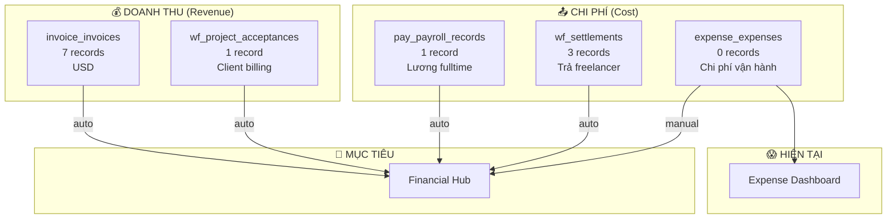

# 📊 Expense Module — Audit & Optimization Plan

## 1. Hiện trạng: Module Expense đang hoạt động "đơn lẻ"

### Phân tích chi tiết

Module Expense hiện tại là một **hệ thống ghi nhận chi phí thủ công, hoàn toàn tách biệt** khỏi các module khác.

| Tính năng | Trạng thái | Ghi chú |
|-----------|------------|---------|
| Tạo chi phí thủ công | ✅ Hoạt động | Nhập tay từng khoản |
| Danh mục chi phí | ✅ 7 categories | Phân loại cơ bản |
| Chi phí định kỳ | ✅ Có UI | Nhưng 0 records |
| Dashboard tổng quan | ✅ Hoạt động | Chỉ hiện data từ `expense_expenses` |
| Lọc theo category/date/status | ✅ Hoạt động | — |
| **Đồng bộ từ Payroll** | ❌ Không có | Lương nhân viên phải nhập lại |
| **Đồng bộ từ Workforce** | ❌ Không có | Chi phí freelancer không tự nhập |
| **Đồng bộ từ Invoice (doanh thu)** | ❌ Không có | Không biết thu bao nhiêu |
| **Lãi/lỗ tổng hợp** | ❌ Không có | Không có P&L view |

### Vấn đề cốt lõi

```
🔴 Module Expense = "Sổ chi tiêu" đơn lẻ
   → Không biết doanh thu (Invoice)
   → Không tự nhận chi phí lương (Payroll)  
   → Không tự nhận chi phí freelancer (Workforce/Settlement)
   → Không có bức tranh tài chính tổng thể
```

---

## 2. Bản đồ dữ liệu tài chính toàn hệ thống



### Chi tiết nguồn dữ liệu

| Module | Bảng DB | Rows | Loại | Đơn vị |
|--------|---------|------|------|--------|
| **Invoice** | `invoice_invoices` | 7 | 💰 Doanh thu | USD |
| **Workforce/Project Acceptance** | `wf_project_acceptances` + `wf_project_acceptance_tasks` | 1 + 33 | 💰 Doanh thu (chi tiết) | VND |
| **Payroll** | `pay_payroll_records` + `pay_payroll_sheets` | 1 + 1 | 📤 Chi phí lương | VND |
| **Workforce/Settlement** | `wf_settlements` + `wf_settlement_tasks` | 3 + 21 | 📤 Chi phí freelancer | VND |
| **Expense** | `expense_expenses` | 0 | 📤 Chi phí vận hành | VND/USD |
| **HR/Salary** | `hr_employee_salary` | 24 | 📤 Chi phí cơ cấu lương | VND |

---

## 3. Kế hoạch tối ưu — 3 Phases

### Phase 1: Auto-Import chi phí từ các module → Expense ⭐ PRIORITY

> [!IMPORTANT]
> Đây là bước quan trọng nhất — tự động đồng bộ chi phí/doanh thu từ các module khác vào `expense_expenses`.

#### 1a. Payroll → Expense (mỗi khi finalize bảng lương)

Khi bảng lương tháng chuyển sang trạng thái `finalized`:
- Tạo 1 expense record tổng: "Lương tháng XX/YYYY"
- Amount = `SUM(total_company_cost)` từ `pay_payroll_records`
- Category = "💼 Lương nhân viên" (auto-create nếu chưa có)
- Source = `payroll:{sheet_id}`

#### 1b. Workforce Settlement → Expense (mỗi khi thanh toán freelancer)

Khi settlement chuyển sang `paid`:
- Tạ 1 expense record: "Freelancer - [Tên] - Kỳ XX/YYYY"
- Amount = `net_amount` từ `wf_settlements`
- Category = "🎨 Freelancer"
- Source = `settlement:{settlement_id}`

#### 1c. Invoice → Expense (ghi nhận doanh thu)

Khi invoice chuyển sang `paid`:
- Tạo 1 **revenue** record: "Doanh thu - [Client] - INV#XXX"
- Amount = `amount_received` (hoặc tổng items)
- Category = "💰 Doanh thu dự án"
- Type = `revenue` (thêm cột mới)

#### Cách triển khai
- **Option A**: Database Trigger (Postgres trigger khi update status)
- **Option B**: Edge Function + webhook nội bộ
- **Recommended**: Postgres trigger (đơn giản, real-time, không tốn API)

---

### Phase 2: Nâng cấp Dashboard → Financial Hub

#### 2a. Thêm Revenue tracking

```
expense_expenses.type = 'expense' | 'revenue'
```

- KPI Cards: Doanh thu vs Chi phí vs Lợi nhuận (Profit)
- Monthly P&L chart (revenue - expenses = profit/loss)

#### 2b. Tổng quan P&L (Profit & Loss)

| Mục | Nguồn | Tự động |
|-----|-------|---------|
| **Doanh thu** | Invoice (paid) | ✅ |
| **(-) Chi phí lương** | Payroll (finalized) | ✅ |
| **(-) Chi phí freelancer** | Settlement (paid) | ✅ |
| **(-) Chi phí vận hành** | Expense (manual) | Manual |
| **= Lợi nhuận ròng** | Tính toán | Auto |

#### 2c. Breakdown chi phí theo nguồn

- Pie chart: Lương vs Freelancer vs Vận hành vs Phần mềm vs ...
- Trend chart: So sánh qua các tháng

---

### Phase 3: Nâng cao (Long-term)

| Feature | Mô tả |
|---------|-------|
| **Budget Planning** | Đặt budget hàng tháng cho mỗi category |
| **Forecast** | Dự báo chi phí dựa trên recurring + payroll |
| **Alert System** | Cảnh báo khi chi phí vượt budget |
| **Export PDF/Excel** | Xuất báo cáo tài chính theo kỳ |
| **Multi-currency** | Auto convert USD↔VND theo VCB rate |
| **Project Profitability** | Lãi/lỗ từng dự án (Revenue - Worker cost) |

---

## 4. Thay đổi Database cần thiết

### Thêm cột cho `expense_expenses`

```sql
-- Phân biệt thu/chi
ALTER TABLE expense_expenses ADD COLUMN type text DEFAULT 'expense' 
  CHECK (type IN ('expense', 'revenue'));

-- Liên kết nguồn gốc (để tránh duplicate)
ALTER TABLE expense_expenses ADD COLUMN source_type text DEFAULT NULL;
-- Values: 'payroll', 'settlement', 'invoice', 'manual'

ALTER TABLE expense_expenses ADD COLUMN source_id uuid DEFAULT NULL;
-- FK tới payroll_sheet.id, settlement.id, invoice.id
```

### Tạo Trigger Functions

```sql
-- Trigger khi settlement chuyển sang 'paid'
CREATE OR REPLACE FUNCTION sync_settlement_to_expense()
RETURNS TRIGGER ...

-- Trigger khi payroll sheet finalized
CREATE OR REPLACE FUNCTION sync_payroll_to_expense()
RETURNS TRIGGER ...

-- Trigger khi invoice chuyển sang 'paid'  
CREATE OR REPLACE FUNCTION sync_invoice_to_expense()
RETURNS TRIGGER ...
```

---

## 5. Ưu tiên triển khai

| # | Việc | Effort | Impact | Status |
|---|------|--------|--------|--------|
| 1 | Thêm `type`, `source_type`, `source_id` vào DB | 🟢 Thấp | 🔴 Cao | ⬜ |
| 2 | Trigger: Settlement → Expense | 🟡 Vừa | 🔴 Cao | ⬜ |
| 3 | Trigger: Payroll → Expense | 🟡 Vừa | 🔴 Cao | ⬜ |
| 4 | Trigger: Invoice → Expense (Revenue) | 🟡 Vừa | 🔴 Cao | ⬜ |
| 5 | Cập nhật Dashboard hiện P&L | 🟡 Vừa | 🔴 Cao | ⬜ |
| 6 | Auto-create categories cho source types | 🟢 Thấp | 🟡 Vừa | ⬜ |
| 7 | Recurring expense auto-generation | 🟡 Vừa | 🟡 Vừa | ⬜ |
| 8 | Export báo cáo tài chính | 🔴 Cao | 🟡 Vừa | ⬜ |

---

> [!TIP]
> **Khuyến nghị**: Bắt đầu từ Phase 1 (items 1-4) — tốn ~2-3 giờ code, nhưng sẽ biến Expense từ "sổ chi tiêu" thành "trung tâm tài chính" thực sự. Mọi dữ liệu từ Payroll, Workforce, Invoice sẽ tự động chảy về đây.

Bạn muốn bắt đầu triển khai từ bước nào?
