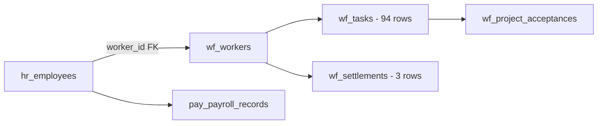

# 📋 Plan: Đồng bộ HR ↔ Workforce + Dashboard Tài chính

## Tổng quan

Mục tiêu: Khi thêm/sửa nhân sự ở HR → tự động đồng bộ sang Workforce (`wf_workers`), kết hợp task tracking để:
- **Freelancer**: Nghiệm thu task → thanh toán
- **Fulltime**: Theo dõi task → đánh giá KPI, tính lãi/lỗ
- **Dashboard**: Tổng quan doanh thu, chi phí, lợi nhuận theo tháng

---

## Hiện trạng hệ thống

### Database Relationships (đã có sẵn)


> [!IMPORTANT]
> Cột `hr_employees.worker_id` FK tới `wf_workers.id` **đã tồn tại** nhưng hiện chưa được sử dụng khi tạo nhân sự mới từ HR module.

### Data hiện tại
| Table | Rows | Ghi chú |
|-------|------|---------|
| `hr_employees` | 9 | 4 fulltime, 5 freelancer |
| `wf_workers` | 5 | Chỉ có freelancer, thêm thủ công |
| `wf_tasks` | 94 | Task từ ClickUp sync |
| `wf_settlements` | 3 | Nghiệm thu freelancer |
| `pay_payroll_records` | 1 | Bảng lương fulltime |

---

## Phase 1: Auto-Sync HR → Workforce (Backend)

### 1.1 Database: Không cần thay đổi schema
- `hr_employees.worker_id` FK đã có sẵn ✅
- `wf_workers.type` đã hỗ trợ `'freelancer' | 'inhouse'` ✅

### 1.2 Service: `hrService.ts` — Auto-create `wf_workers` on employee save

Khi tạo/cập nhật nhân sự từ HR:

```typescript
// hrService.ts — thêm logic auto-sync
async function syncEmployeeToWorkforce(employee: HrEmployee): Promise<string> {
  // Kiểm tra đã có worker chưa (by email or worker_id)
  if (employee.worker_id) {
    // Update existing worker
    await supabase.from('wf_workers').update({
      full_name: employee.full_name,
      email: employee.email,
      phone: employee.phone,
      bank_name: employee.bank_name,
      bank_account: employee.bank_account,
      tax_code: employee.tax_code,
      type: employee.type === 'fulltime' ? 'inhouse' : 'freelancer',
      is_active: employee.status === 'active',
    }).eq('id', employee.worker_id);
    return employee.worker_id;
  }

  // Tìm theo email trước
  const { data: existing } = await supabase
    .from('wf_workers')
    .select('id')
    .eq('email', employee.email)
    .single();

  if (existing) {
    // Link existing worker
    await supabase.from('hr_employees')
      .update({ worker_id: existing.id })
      .eq('id', employee.id);
    return existing.id;
  }

  // Tạo mới worker
  const { data: newWorker } = await supabase
    .from('wf_workers')
    .insert({
      full_name: employee.full_name,
      email: employee.email,
      phone: employee.phone,
      bank_name: employee.bank_name,
      bank_account: employee.bank_account,
      tax_code: employee.tax_code,
      type: employee.type === 'fulltime' ? 'inhouse' : 'freelancer',
      is_active: employee.status === 'active',
      notes: `Auto-synced from HR - ${employee.employee_code}`,
    })
    .select('id')
    .single();

  // Lưu worker_id vào hr_employees
  await supabase.from('hr_employees')
    .update({ worker_id: newWorker.id })
    .eq('id', employee.id);

  return newWorker.id;
}
```

### 1.3 Trigger points (gọi sync)
- `saveEmployee()` → sau khi insert thành công → gọi `syncEmployeeToWorkforce()`
- `updateEmployee()` → sau khi update → gọi `syncEmployeeToWorkforce()`
- `QuickAddEmployee` form → sau khi save → gọi `syncEmployeeToWorkforce()`
- Nút "🔄 Sync tất cả" trên trang HR → batch sync toàn bộ 9 nhân viên hiện tại

### 1.4 Backfill: Sync nhân sự hiện tại

```sql
-- Script chạy 1 lần: Tạo wf_workers cho HR employees chưa có worker_id
INSERT INTO wf_workers (full_name, email, phone, bank_name, bank_account, tax_code, type, is_active, notes)
SELECT 
  e.full_name, e.email, e.phone, e.bank_name, e.bank_account, e.tax_code,
  CASE WHEN e.type = 'fulltime' THEN 'inhouse' ELSE 'freelancer' END,
  e.status = 'active',
  'Backfill from HR - ' || COALESCE(e.employee_code, '')
FROM hr_employees e
WHERE e.worker_id IS NULL
  AND NOT EXISTS (SELECT 1 FROM wf_workers w WHERE w.email = e.email);

-- Sau đó link worker_id
UPDATE hr_employees e
SET worker_id = w.id
FROM wf_workers w
WHERE w.email = e.email AND e.worker_id IS NULL;
```

---

## Phase 2: Task Tracking theo loại nhân sự

### 2.1 Freelancer — Nghiệm thu & Thanh toán (đã có ~90%)

Luồng hiện tại đã hoạt động:
```
ClickUp Task → wf_tasks (sync) → Nghiệm thu (wf_settlements) → Thanh toán
```

**Cần bổ sung:**
- Khi xem chi tiết freelancer ở HR → hiển thị danh sách tasks từ `wf_tasks` (JOIN qua `worker_id`)
- Hiển thị tổng tiền chưa thanh toán (unpaid tasks)

### 2.2 Fulltime — KPI & Lãi/Lỗ 

Luồng mới:
```
ClickUp Task → wf_tasks (sync, gán worker fulltime) 
  → So sánh: Doanh thu task (client_price) vs Chi phí nhân sự (lương/tháng)
  → KPI score = Tổng client_price / Chi phí lương
```

#### 2.2.1 Database: Thêm `client_price` context cho fulltime tasks

`wf_project_acceptance_tasks` đã có `client_price` ✅ — dùng luôn cho cả fulltime.

Khi tạo Project Acceptance, giá client (`client_price`) được gán cho từng task. Đây chính là **doanh thu** mà task đó tạo ra.

#### 2.2.2 Tính KPI fulltime employee

```typescript
interface FulltimeKPI {
  employeeId: string;
  period: string; // "2026-04"
  
  // Chi phí (từ pay_payroll_records)
  totalCompanyCost: number;      // Gross + BH công ty
  
  // Doanh thu (từ wf_tasks + wf_project_acceptance_tasks)  
  totalTaskRevenue: number;       // Tổng client_price của tasks hoàn thành
  totalTaskCount: number;         // Số task hoàn thành
  
  // Hiệu suất
  profitLoss: number;             // revenue - cost
  roiPercent: number;             // (revenue - cost) / cost * 100
  kpiScore: 'A' | 'B' | 'C' | 'D' | 'F';
}
```

**Thang KPI đề xuất:**
| Score | ROI | Ý nghĩa |
|-------|-----|---------|
| A | ≥ 150% | Xuất sắc — tạo lợi nhuận cao |
| B | 100–149% | Tốt — hoà vốn trở lên |
| C | 50–99% | Trung bình — chưa đạt hoà vốn |
| D | 1–49% | Yếu — lỗ đáng kể |
| F | ≤ 0% | Không có output |

> [!NOTE]
> Thang KPI này chỉ dựa trên tài chính. Có thể bổ sung thêm các chỉ số khác (chất lượng, deadline compliance) sau.

---

## Phase 3: Financial Dashboard — Tổng quan tài chính

### 3.1 UI: Tab mới "📊 Dashboard" trong Workforce module

Thêm 1 tab mới vào `WorkforceApp.tsx`:

```
[Nhân sự] [Task] [Nghiệm thu] [NT Dự Án] [📊 Dashboard] [Cấu hình]
```

### 3.2 Dashboard Layout

```
┌─────────────────────────────────────────────────────────────┐
│  📊 TỔNG QUAN TÀI CHÍNH — THÁNG 4/2026                     │
│  ◄ Tháng trước        [Chọn tháng ▼]        Tháng sau ►     │
├─────────────┬──────────────┬──────────────┬─────────────────┤
│ 💰 DOANH THU │ 📉 CHI PHÍ    │ 💎 LỢI NHUẬN  │ 📊 ROI          │
│ $8,500      │ $6,200       │ $2,300       │ 137%            │
│ ≈ 212.5M VND│ ≈ 155.0M VND │ ≈ 57.5M VND  │ (Profitable)    │
└─────────────┴──────────────┴──────────────┴─────────────────┘

┌─────────────────────────────────────────────────────────────┐
│ 📋 CHI TIẾT CHI PHÍ TRONG THÁNG                             │
├─────────────────────────────────────────────────────────────┤
│                                                             │
│  ▸ Fulltime Payroll (Tổng lương)          155,000,000 VND   │
│    ├─ Nguyễn Minh Châu (FT-001)           18,000,000       │
│    ├─ Đinh Trí Bảo Anh (FT-002)           15,000,000       │
│    └─ ...                                                   │
│                                                             │
│  ▸ Freelancer Payments (Chưa TT)           25,000,000 VND   │
│    ├─ Nguyễn Quang Huy (5 tasks)           12,000,000       │
│    ├─ Phạm Minh Giang (3 tasks)             8,000,000       │
│    └─ Nguyễn Ngọc Anh (2 tasks)             5,000,000       │
│                                                             │
│  ▸ Operational Expenses                    15,000,000 VND   │
│    (Từ module Expense)                                      │
│                                                             │
│  TỔNG CHI PHÍ:                            195,000,000 VND   │
└─────────────────────────────────────────────────────────────┘

┌─────────────────────────────────────────────────────────────┐
│ 👤 HIỆU SUẤT NHÂN SỰ FULLTIME                              │
├──────────────────┬───────┬──────────┬────────┬─────┬───────┤
│ Nhân viên        │ Tasks │ Doanh thu│Chi phí │ L/L │ KPI   │
├──────────────────┼───────┼──────────┼────────┼─────┼───────┤
│ Nguyễn Minh Châu │  12   │ $3,200   │ $720   │+$2.5K│  A   │
│ Đinh Trí Bảo Anh │   8   │ $1,800   │ $600   │+$1.2K│  B   │
│ Nguyễn Đức Hiếu  │   5   │ $500     │ $550   │ -$50 │  C   │
│ Nguyễn Văn Tú    │   3   │ $200     │ $500   │-$300 │  D   │
└──────────────────┴───────┴──────────┴────────┴─────┴───────┘

┌─────────────────────────────────────────────────────────────┐
│ 💸 FREELANCER — THANH TOÁN TRONG THÁNG                      │
├──────────────────┬───────┬──────────┬────────┬──────────────┤
│ Freelancer       │ Tasks │ Tổng tiền│ Thuế   │ Trạng thái   │
├──────────────────┼───────┼──────────┼────────┼──────────────┤
│ Nguyễn Q. Huy    │  5    │ $480     │ $48    │ 🟡 Chưa TT    │
│ Phạm M. Giang    │  3    │ $320     │ $32    │ 🟢 Đã TT      │
│ Nguyễn N. Anh    │  2    │ $200     │ $20    │ 🟡 Chưa TT    │
└──────────────────┴───────┴──────────┴────────┴──────────────┘
```

### 3.3 Data Sources cho Dashboard

| Metric | Source | Query |
|--------|--------|-------|
| **Doanh thu** | `wf_project_acceptances` + `wf_project_acceptance_tasks.client_price` | SUM tasks approved trong tháng |
| **Chi phí Fulltime** | `pay_payroll_records.total_company_cost` | Bảng lương tháng đó |
| **Chi phí Freelancer** | `wf_settlements.net_amount` | Nghiệm thu freelancer trong tháng |
| **Chi phí vận hành** | `expense_expenses.amount` | Chi phí khác trong tháng |
| **Tasks/người** | `wf_tasks` WHERE `worker_id` = X AND `completed_at` trong tháng | COUNT + SUM |

### 3.4 Service: `dashboardService.ts` (mới)

```typescript
interface MonthlyFinancialSummary {
  period: { month: number; year: number };
  
  // Revenue
  totalRevenue: number;            // Từ project acceptances
  revenueCurrency: string;         // USD
  revenueVND: number;              // Quy đổi VND
  
  // Costs
  fulltimePayroll: number;         // Tổng lương fulltime (VND)
  freelancerPayments: number;      // Tổng thanh toán freelancer (VND)
  operationalExpenses: number;     // Chi phí vận hành (VND)
  totalCost: number;
  
  // P&L
  grossProfit: number;
  profitMargin: number;            // %
  
  // Breakdowns
  fulltimeBreakdown: FulltimeKPI[];
  freelancerBreakdown: FreelancerPaymentSummary[];
}

interface FreelancerPaymentSummary {
  workerId: string;
  workerName: string;
  taskCount: number;
  totalAmount: number;
  taxAmount: number;
  netAmount: number;
  paymentStatus: 'unpaid' | 'partial' | 'paid';
}
```

---

## Phase 4: UI Updates

### 4.1 HR Module — Hiển thị link Workforce

Trong `EmployeeForm.tsx`, thêm section "📋 Task History" cho mỗi nhân viên:
- Hiển thị số tasks đã hoàn thành
- Link qua Workforce module để xem chi tiết
- Nút "Xem tasks trên Workforce →"

### 4.2 Workforce Module — Tab Dashboard mới

File mới: `apps/workforce/components/FinancialDashboard.tsx`
- Month picker (tháng/năm)
- 4 KPI cards (Doanh thu, Chi phí, Lợi nhuận, ROI)
- Bảng chi tiết fulltime KPI
- Bảng freelancer payments
- Bảng chi phí vận hành

### 4.3 Workforce WorkerList — Badge HR Synced

Thêm badge "HR ✅" cho workers đã link với `hr_employees`.

---

## Phase 5: Triển khai theo thứ tự

### Sprint 1 (Ưu tiên cao — Backend Sync)
1. ☐ Backfill: Chạy SQL sync 9 nhân viên hiện tại
2. ☐ `hrService.ts`: Thêm `syncEmployeeToWorkforce()`
3. ☐ Hook vào `saveEmployee()` + `updateEmployee()`
4. ☐ Hook vào `QuickAddEmployee` flow
5. ☐ Test: Thêm nhân sự mới → verify xuất hiện ở Workforce

### Sprint 2 (Dashboard Service)
6. ☐ Tạo `dashboardService.ts` — fetch & aggregate data
7. ☐ Implement `calculateFulltimeKPI()` 
8. ☐ Implement `getFreelancerPaymentSummary()`
9. ☐ Implement `getMonthlyFinancialSummary()`

### Sprint 3 (UI)
10. ☐ Tạo `FinancialDashboard.tsx` component
11. ☐ Thêm tab "Dashboard" vào `WorkforceApp.tsx`
12. ☐ Thêm task summary section vào `EmployeeForm.tsx`
13. ☐ Badge "HR ✅" trên WorkerList

### Sprint 4 (Polish)
14. ☐ Export dashboard ra Excel
15. ☐ Chart doanh thu/chi phí theo tháng (trend line)
16. ☐ Auto-refresh khi có data mới

---

## Câu hỏi cần xác nhận trước khi triển khai

> [!WARNING]
> Cần xác nhận từ bạn trước khi bắt tay vào code:

1. **Thang KPI**: Bảng KPI đề xuất (A/B/C/D/F dựa trên ROI) có phù hợp không? Hay bạn muốn tiêu chí khác?

2. **Doanh thu fulltime**: Tính doanh thu cho fulltime bằng `client_price` từ Project Acceptance — đúng ý bạn không? 
   - Nghĩa là: task phải được gán vào Project Acceptance (NT Dự Án) để có giá client
   
3. **Chi phí fulltime**: Dùng `total_company_cost` từ bảng lương (gross + BH công ty) — OK?

4. **Tỷ giá**: Dashboard hiển thị song song USD + VND, dùng tỷ giá VCB live — OK?

5. **Scope Sprint 1**: Muốn triển khai Sprint 1 (backend sync) trước, hay muốn làm cả 4 sprint một lúc?
