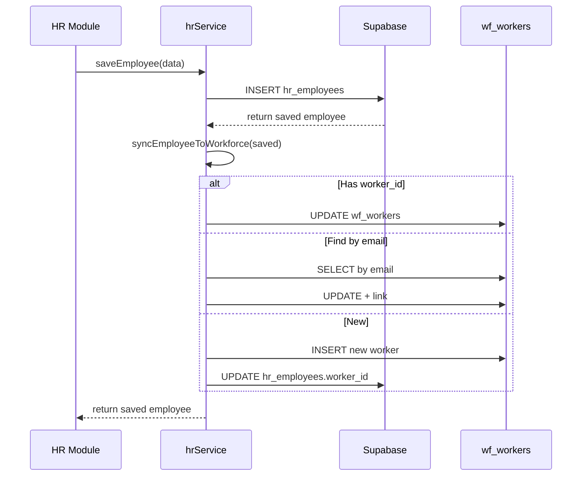

# ✅ Sprint 1 — HR → Workforce Sync — HOÀN THÀNH

## Kết quả

## Checklist Sprint 1

| # | Task | Status |
|---|------|--------|
| 1 | Backfill: Sync 9 nhân viên hiện tại | ✅ Done |
| 2 | `hrService.ts`: Thêm `syncEmployeeToWorkforce()` | ✅ Done |
| 3 | Hook vào `saveEmployee()` + `updateEmployee()` | ✅ Done |
| 4 | Hook vào `QuickAddEmployee` flow | ✅ Auto-covered |
| 5 | UI: Nút "Sync WF" + badge "WF ✓" | ✅ Done |
| 6 | Test trên browser | ✅ Verified |

## Chi tiết thay đổi

### Database (Supabase SQL)
- Backfill: 9 HR employees → 9 wf_workers (đã link worker_id)
- Cleanup: Xóa 5 bản ghi wf_workers trùng lặp (empty email)
- Fixed: Mapping chính xác 4 fulltime (inhouse) + 5 freelancer

### Code Changes

| File | Changes |
|------|---------|
| [types.ts](file:///e:/TDC_App/TDGAMES_App/td-games-invoice-app/types.ts) | Added `worker_id: string \| null` to `HrEmployee` |
| [hrService.ts](file:///e:/TDC_App/TDGAMES_App/td-games-invoice-app/apps/hr/services/hrService.ts) | Added `syncEmployeeToWorkforce()` + `syncAllEmployeesToWorkforce()`, hooked into save/update |
| [useHrState.ts](file:///e:/TDC_App/TDGAMES_App/td-games-invoice-app/apps/hr/hooks/useHrState.ts) | Added `handleSyncAllToWorkforce` handler |
| [EmployeeList.tsx](file:///e:/TDC_App/TDGAMES_App/td-games-invoice-app/apps/hr/components/EmployeeList.tsx) | Added "Sync WF" button + "WF ✓" badge per employee |
| [HrApp.tsx](file:///e:/TDC_App/TDGAMES_App/td-games-invoice-app/apps/hr/components/HrApp.tsx) | Passed `onSyncWorkforce` prop |

### Luồng hoạt động

## Next: Sprint 2
- Dashboard Service (`dashboardService.ts`)
- KPI calculation for fulltime employees
- Financial summary aggregation
