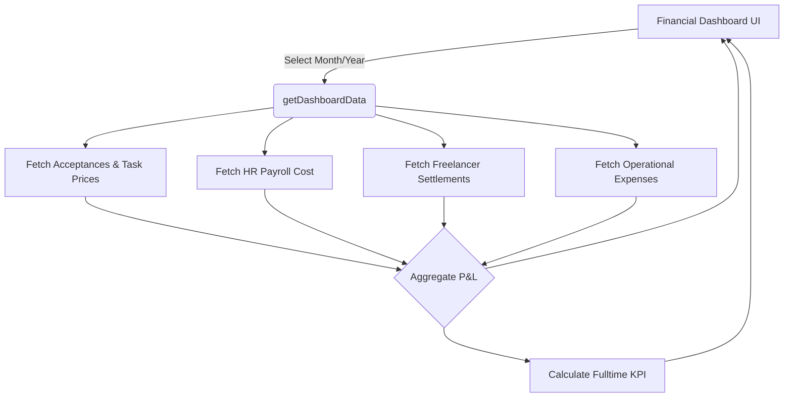

# ✅ Sprint 2 — Financial Dashboard & KPI — HOÀN THÀNH

## Kết quả

## Checklist Sprint 2

| # | Task | Status |
|---|------|--------|
| 1 | Create `dashboardService.ts` for P&L aggregation | ✅ Done |
| 2 | Calculate Revenue (`wf_project_acceptances` & tasks) | ✅ Done |
| 3 | Calculate Fulltime Cost (`pay_payroll_records`) | ✅ Done |
| 4 | Calculate Freelancer Cost (`wf_settlements`) | ✅ Done |
| 5 | Define KPI Engine (A-F based on ROI) | ✅ Done |
| 6 | Create UI `FinancialDashboard.tsx` | ✅ Done |
| 7 | Integrate new tab "Tổng Quan" into WorkforceApp | ✅ Done |

## Chi tiết hệ thống Dashboard

### 1. Engine Tổng hợp (`dashboardService.ts`)
Dashboard Engine sẽ kéo dữ liệu từ nhiều nguồn khác nhau dựa trên tham số Tháng/Năm:
- **Doanh thu**: `wf_project_acceptances` (chỉ lấy các phiếu `approved`).
- **Chi phí Fulltime**: `pay_payroll_records` kết nối với `pay_payroll_sheets` (đã duyệt/đã chi).
- **Chi phí Freelancer**: `wf_settlements` (lấy `net_amount` thực nhận sau thuế).
- **Chi phí Vận hành**: `expense_expenses` (tùy chọn mở rộng cho chi phí chung).

### 2. Hệ thống đánh giá KPI Nhân Sự Fulltime
Hệ thống tự động tính ROI cho từng cá nhân (Fulltime) như sau:
1. Xác định `worker_id` từ HR Module.
2. Quét toàn bộ các task mà nhân sự đó đã làm (`wf_tasks`).
3. Đối chiếu xem task đó có nằm trong phiếu Nghiệm Thu Dự Án (`wf_project_acceptance_tasks`) đã được duyệt trong tháng hay không. Nếu có, trích xuất `client_price` cộng vào **Doanh thu cá nhân**.
4. Trích xuất `total_company_cost` (Lương Gross + BHXH + Phụ cấp) từ bảng lương tháng.
5. Tính Lãi/Lỗ: `Doanh thu - Chi phí`
6. Đánh giá KPI (A-F):
   - **A**: ROI ≥ 150%
   - **B**: ROI ≥ 100%
   - **C**: ROI ≥ 50%
   - **D**: ROI > 0%
   - **F**: Lỗ (ROI < 0%)
   - **N/A**: Chưa phát sinh chi phí hoặc doanh thu trong tháng.

### 3. UI Component (`FinancialDashboard.tsx`)
- Thêm Filter chọn Tháng/Năm trực quan trên header.
- Thẻ thống kê nhanh: Doanh thu (USD/VND), Chi phí (VND), Lợi Nhuận, và % ROI.
- Bảng **Cơ cấu chi phí**: Tách biệt rõ ràng Lương Inhouse, Thanh toán Freelancer, và Chi phí vận hành.
- Bảng **Hiệu suất Fulltime**: Hiển thị chi tiết số task, doanh thu, chi phí, và xếp loại KPI.
- Bảng **Thanh toán Freelancer**: Thống kê số tiền tổng, thuế khấu trừ (nếu có), và thực nhận.

## Luồng hoạt động

## Next: Sprint 3 (UI Links)
- Tích hợp Link "Xem Task History" trực tiếp trong Form nhân sự HR.
- Hiển thị KPI của tháng trước ngay trong Profile HR.
