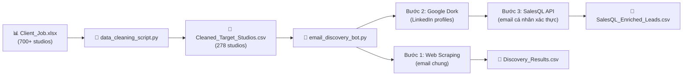

# B2B Email Discovery Pipeline - TD Games Outsource

Pipeline tự động 3 bước để thu thập email contact từ 700+ Game Studios, phục vụ chiến dịch Cold Email marketing dịch vụ Outsource (Art, Animation, VFX, Production).

## Kiến trúc Pipeline



## File Scripts

### 1. `data_cleaning_script.py` — Tiền xử lý
- Quét toàn bộ 9 sheet excel, trích xuất Domain từ URL tuyển dụng.
- Lọc bỏ domain ATS dùng chung (Greenhouse, Lever, Bamboohr...).
- Output: **278 Game Studios** độc lập → `Cleaned_Target_Studios.csv`

### 2. `email_discovery_bot.py` — Cỗ máy chính (3 bước)

| Bước | Phương pháp | Chi phí | Output |
|------|------------|---------|--------|
| **1. Web Scraping** | Cào trang `/contact`, `/about`, `/partners`, `/outsource` + regex + mailto | Miễn phí | Email chung: `contact@`, `info@`, `partners@` |
| **2. Google Dork** | `site:linkedin.com/in "Studio" ("Art Director" OR "Producer" OR ...)` | Miễn phí | LinkedIn URL của quản lý cấp cao |
| **3. SalesQL API** | `GET /v1/persons/enrich/?linkedin_url=...` → enrichment | Credit SalesQL | **Email cá nhân xác thực** + Tên + Chức danh + SĐT |

#### Chiến lược tiết kiệm Credit SalesQL
- Bật `match_if_direct_email=True` → Credit chỉ bị trừ khi tìm ĐƯỢC email
- Tối đa 3 LinkedIn profiles/studio, dừng ngay khi tìm được contact đầu tiên
- Ưu tiên title đúng target: Product Manager, Art Director, Animation Lead, VFX Lead

---

## Hướng dẫn sử dụng

### Cách 1: Chạy KHÔNG có SalesQL (chỉ Web Scraping + Google Dork)
```powershell
cd e:\TDC_App\TDGAMES_App\Client_Data
python data_cleaning_script.py
python email_discovery_bot.py
```
Kết quả: `Discovery_Results.csv` chứa email chung + LinkedIn URLs (để bạn dùng thủ công trên SalesQL Extension).

### Cách 2: Chạy CÓ SalesQL API (tự động enrichment hoàn toàn)
```powershell
cd e:\TDC_App\TDGAMES_App\Client_Data

# Đặt API Key (1 lần duy nhất trong session)
$env:SALESQL_API_KEY = "your_salesql_api_key_here"

python data_cleaning_script.py
python email_discovery_bot.py
```
Kết quả bổ sung: `SalesQL_Enriched_Leads.csv` chứa **email cá nhân xác thực** + tên + chức danh + SĐT.

### Chuyển sang chạy thật (toàn bộ 278 studios)
Mở file `email_discovery_bot.py`, đổi dòng cấu hình:
```python
TEST_MODE = False   # Tắt chế độ thử nghiệm
```

> [!WARNING]
> **Rate Limit Google Search:** Google sẽ chặn IP nếu search liên tục quá nhanh. Code đã có delay tự động (`GOOGLE_DELAY = 3s`). Nếu chạy 278 studios, tổng thời gian ~15-20 phút. Cân nhắc dùng VPN hoặc Rotating Proxy nếu bị chặn.
