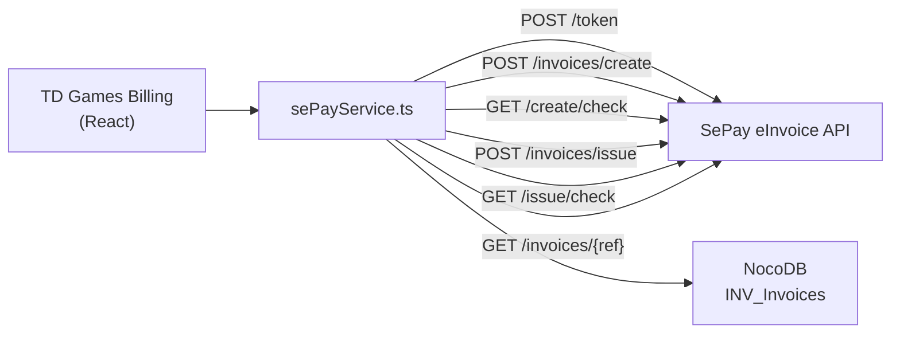

# Plan: Tích hợp SePay eInvoice API

## Tổng quan

Tích hợp SePay eInvoice cho phép app xuất hóa đơn điện tử hợp lệ theo quy định Tổng cục Thuế, song song với các export hiện tại (PDF, PNG, Excel, Word).

---

## Kiến trúc tích hợp



---

## Proposed Changes

### 1. Config & Credentials

#### [MODIFY] `.env.local`
Thêm các env vars:
```
VITE_SEPAY_BASE_URL=https://einvoice-api-sandbox.sepay.vn
VITE_SEPAY_CLIENT_ID=<client_id>
VITE_SEPAY_CLIENT_SECRET=<client_secret>
VITE_SEPAY_PROVIDER_ACCOUNT_ID=<provider_account_id>
```

---

### 2. Service Layer

#### [NEW] `services/sePayService.ts`
Các function chính:

| Function | Mô tả |
|----------|-------|
| `getAccessToken()` | POST `/v1/token`, cache token + expiry |
| `getProviderAccounts()` | GET `/v1/provider-accounts` |
| `createEInvoice(invoice)` | POST `/v1/invoices/create`, map InvoiceData → SePay format |
| `checkCreateStatus(tracking_code)` | Poll GET `/v1/invoices/create/check/{code}` |
| `issueEInvoice(reference_code)` | POST `/v1/invoices/issue` |
| `checkIssueStatus(tracking_code)` | Poll GET `/v1/invoices/issue/check/{code}` |
| `getEInvoiceDetail(reference_code)` | GET `/v1/invoices/{reference_code}` → PDF/XML URLs |
| `checkUsage()` | GET `/v1/usage` |

**Lưu ý quan trọng về async polling:**
- Create và Issue đều bất đồng bộ → phải poll `/check` sau mỗi bước
- Chiến lược: retry mỗi 2 giây, tối đa 30 lần (~1 phút)

---

### 3. Data Mapping

Cần map `InvoiceData` (format nội bộ) → format SePay:

| InvoiceData | SePay field |
|-------------|-------------|
| `studioInfo.name` | `seller.name` |
| `studioInfo.taxCode` | `seller.tax_code` |
| `studioInfo.address` | `seller.address` |
| `clientInfo.name` | `buyer.name` |
| `clientInfo.taxCode` | `buyer.tax_code` |
| `clientInfo.address` | `buyer.address` |
| `items[].description` | `items[].name` |
| `items[].quantity` | `items[].quantity` |
| `items[].unitPrice` | `items[].unit_price` |
| `taxRate` | `tax_rate` |
| `discountValue` | `discount` |
| `currency` | `currency` |
| `issueDate` | `issue_date` |
| `invoiceNumber` | `reference_code` (nội bộ) |

> ⚠️ **Cần clarify với SePay**: format chính xác của payload (tên field, nested structure) cần xác nhận từ docs chi tiết.

---

### 4. NocoDB Schema Update

#### [MODIFY] `INV_Invoices` table — thêm các cột:

| Cột | Type | Mô tả |
|-----|------|-------|
| `einvoice_status` | SingleSelect: `none / creating / created / issuing / issued / failed` | Trạng thái eInvoice |
| `einvoice_reference_code` | Text | Mã hóa đơn CQT cấp |
| `einvoice_tracking_create` | Text | tracking_code bước create |
| `einvoice_tracking_issue` | Text | tracking_code bước issue |
| `einvoice_pdf_url` | URL | Link tải PDF hóa đơn điện tử |
| `einvoice_xml_url` | URL | Link tải XML |

---

### 5. UI Changes

#### [MODIFY] `App.tsx`

**Trong tab `edit` / `preview` — thêm button:**
```
[ EXPORT PDF ]  [ Save Invoice ]  [ 📄 Xuất HĐ Điện Tử ]
```

**Flow khi click "Xuất HĐ Điện Tử":**
1. Modal xác nhận → hiện thông tin invoice tóm tắt
2. Loading stepper: **Tạo HĐ** → **Phát hành** → **Hoàn tất**
3. Thành công → hiện link tải PDF/XML điện tử
4. Lỗi → hiện message rõ ràng từng bước

**Trong tab `history`:**
- Hiện badge trạng thái eInvoice trên mỗi invoice card
- Nút download PDF/XML điện tử nếu đã issued

---

## Các điểm cần xác nhận trước khi code

> [!IMPORTANT]
> Cần có để bắt đầu implement:
> 1. **Credentials SePay**: `client_id`, `client_secret` (Sandbox trước)
> 2. **Provider Account ID**: ID tài khoản eInvoice đã đăng ký với SePay
> 3. **Docs payload chi tiết**: Cấu trúc JSON chính xác cho `POST /v1/invoices/create`
> 4. **Mẫu hóa đơn**: Ký hiệu/mẫu số cần truyền vào API

---

## Verification Plan

### Sandbox Testing
1. Lấy token thành công
2. Create invoice → nhận `tracking_code`
3. Poll `create/check` → status `success`
4. Issue invoice → nhận `tracking_code` issue
5. Poll `issue/check` → status `success`
6. Lấy detail → có `pdf_url`, `xml_url`
7. Download và mở file PDF kiểm tra nội dung

### Production Checklist
- [ ] Đổi `VITE_SEPAY_BASE_URL` sang production URL
- [ ] Kiểm tra hạn ngạch `/v1/usage`
- [ ] Test end-to-end với hóa đơn thật
