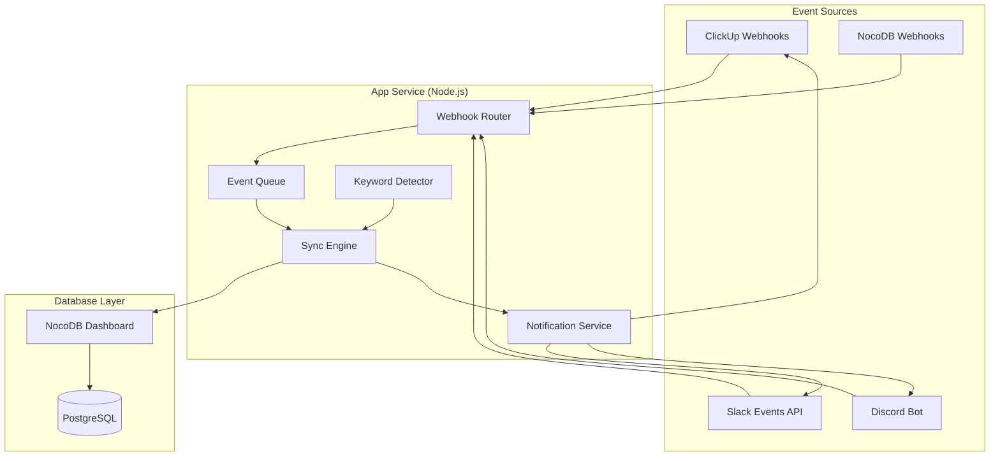

# 📋 Review: Multi-Platform Workflow Automation Tool

## Overall Rating: ⭐⭐⭐⭐ (4/5) — Solid foundation, needs refinement

Plan tổng thể **rất tốt** — kiến trúc rõ ràng, workflow hợp lý, và việc chọn NocoDB làm central hub là smart choice. Dưới đây là đánh giá chi tiết và các cải thiện quan trọng.

---

## ✅ Điểm Mạnh

| Aspect | Assessment |
|--------|------------|
| **NocoDB as central hub** | Rất hay — PM xem mọi thứ từ 1 nơi, không cần custom dashboard |
| **Bi-directional sync** | Đúng hướng — comment sync qua NocoDB trước rồi broadcast |
| **Docker Compose** | Chuẩn production — dễ deploy, scale, maintain |
| **Keyword automation** | Thực tế — giảm manual work cho team |
| **Views thay reports** | Thông minh — tận dụng NocoDB built-in thay vì code custom |

---

## ⚠️ Các Vấn Đề Cần Cải Thiện

### 1. 🔴 Thiếu xử lý Event/Webhook rõ ràng

> [!CAUTION]
> Spec chưa nói rõ **cách nhận events** từ các platform. Đây là phần cốt lõi nhất.

**Vấn đề:** Spec nói "Trigger: New task in ClickUp" nhưng không nói rõ mechanism.

**Cần bổ sung:**
- **ClickUp Webhooks** → Cần đăng ký webhook cho `taskCreated`, `taskStatusUpdated`, `taskCommentPosted`
- **Slack Events API** → Cần Slack App với Event Subscriptions (`message.channels`, `message.groups`)
- **Discord Gateway/Bot** → Cần Discord Bot với `messageCreate` event
- **NocoDB Webhooks** → Khi Lead thay đổi status trên NocoDB grid → trigger webhook

**Recommendation:** Thêm mục **"Event Sources & Webhook Architecture"** vào spec:
```
Event Sources:
├── ClickUp Webhooks → POST /webhooks/clickup
├── Slack Events API → POST /webhooks/slack
├── Discord Bot Gateway → WebSocket connection
└── NocoDB Webhooks → POST /webhooks/nocodb
```

---

### 2. 🔴 Schema quá đơn giản — Thiếu nhiều fields quan trọng

**Vấn đề:** Schema hiện tại thiếu nhiều thông tin cần cho workflow thực tế.

**Bảng Tasks — Đề xuất bổ sung:**

| Field | Type | Lý do |
|-------|------|-------|
| `Priority` | Select (Urgent/High/Normal/Low) | Cần để filter và sort |
| `Due_Date` | DateTime | Tracking deadline |
| `Project` | SingleLineText hoặc Link | Nhóm tasks theo project |
| `Client` | SingleLineText | Biết task của client nào |
| `Created_At` | DateTime | Audit trail |
| `Updated_At` | DateTime | Track last activity |
| `Slack_Channel` | SingleLineText | Channel nào chứa thread |
| `Discord_Channel_ID` | SingleLineText | Channel nào chứa thread |
| `ClickUp_List_ID` | SingleLineText | Để navigate back |

**Bảng Comments — Nên là REQUIRED, không optional:**

| Field | Type | Lý do |
|-------|------|-------|
| `Author` | SingleLineText | Ai comment |
| `Author_Platform_ID` | SingleLineText | Map user across platforms |
| `Message_ID` | SingleLineText | Để trả lời/reference |
| `Is_Broadcasted` | Checkbox | Đánh dấu đã sync chưa |

**Bảng mới — `Users` (Mapping table):**

| Field | Type | Lý do |
|-------|------|-------|
| `Name` | SingleLineText | Tên nhân viên |
| `ClickUp_ID` | SingleLineText | User ID trên ClickUp |
| `Slack_ID` | SingleLineText | User ID trên Slack |
| `Discord_ID` | SingleLineText | User ID trên Discord |
| `Role` | Select (Dev/Lead/PM/Client) | Phân quyền notify |

> [!IMPORTANT]
> Bảng `Users` là **bắt buộc** để biết notify ai, trên platform nào, khi có event xảy ra.

---

### 3. 🟡 Thiếu Error Handling & Retry Strategy

**Vấn đề:** Network có thể fail, API rate limit, webhook có thể miss. Spec chưa đề cập.

**Cần bổ sung:**
- **Retry Queue** — Khi một platform fail, lưu vào queue và retry (3 lần, exponential backoff)
- **Dead Letter Table** — Bảng `Failed_Events` trên NocoDB để PM thấy event nào bị lỗi
- **Idempotency** — Dùng `Message_ID` / `ClickUp_ID` để tránh duplicate sync
- **Health Check Endpoint** — `/health` để monitor trên VPS

---

### 4. 🟡 Keyword Automation quá cứng nhắc (Phase 4)

**Vấn đề:** Chỉ detect "Approved" / "Fixed" là quá đơn giản và dễ false positive.

**Cải thiện:**
- Dùng **prefix format**: `!approved`, `!fix`, `/approved` để tránh nhầm
- Hoặc dùng **Slack/Discord Reactions** (emoji ✅ = approved, 🔧 = fix) — reliable hơn text
- Chỉ xử lý keywords từ **authorized users** (PM/Client), không phải ai cũng trigger được
- Thêm **confirmation step**: Bot hỏi "Are you sure?" trước khi close task

---

### 5. 🟡 Chọn Tech Stack — Node.js > Python cho use case này

**Recommendation:** Chọn **Node.js (Express/Fastify)** thay Python vì:

| Factor | Node.js | Python (FastAPI) |
|--------|---------|-------------------|
| Discord.js | ✅ Native, mature library | ❌ discord.py (less maintained) |
| Slack SDK | ✅ `@slack/bolt` — excellent | ⚠️ `slack_sdk` — good but less event-driven |
| Real-time events | ✅ Event-loop native | ⚠️ Needs asyncio setup |
| NocoDB SDK | ✅ JS SDK available | ⚠️ REST API only |
| ClickUp SDK | ✅ JS community packages | ⚠️ REST API only |

---

### 6. 🟢 NocoDB Views (Phase 5) — Mở rộng thêm

Spec đã tốt, thêm vài views hữu ích:

| View | Type | Purpose |
|------|------|---------|
| **All Tasks** | Grid | Default view cho PM |
| **By Status** | Kanban | Grouped by Status |
| **My Tasks** | Grid + Filter | Filtered by Assignee |
| **Client View** | Grid + Shared | Chỉ show Client Review tasks, share link cho client |
| **Failed Events** | Grid | Monitor sync errors |
| **Overdue Tasks** | Grid + Filter | Due_Date < Today & Status != Closed |

---

## 🏗️ Kiến Trúc Đề Xuất Cải Tiến



**Thêm Event Queue** giữa Webhook Router và Sync Engine để:
- Buffer events khi load cao
- Retry failed syncs
- Đảm bảo thứ tự xử lý

---

## 📋 Recommended Implementation Order

| Phase | Nội dung | Ưu tiên | Độ khó |
|-------|----------|---------|--------|
| **0** | Setup Docker Compose + NocoDB Schema + Users table | 🔴 Critical | ⭐⭐ |
| **1** | ClickUp → NocoDB sync (one-way first) | 🔴 Critical | ⭐⭐⭐ |
| **1.5** | Slack thread + Discord thread creation | 🔴 Critical | ⭐⭐⭐ |
| **2** | Bi-directional comment sync | 🟡 High | ⭐⭐⭐⭐ |
| **3** | Status change notifications (Lead Review) | 🟡 High | ⭐⭐⭐ |
| **4** | Keyword/Reaction automation | 🟢 Medium | ⭐⭐ |
| **5** | NocoDB Views + Client shared views | 🟢 Medium | ⭐ |
| **6** | Error handling, retry, monitoring | 🟡 High | ⭐⭐⭐ |

---

## 🔒 Security Considerations (Thiếu trong spec)

> [!WARNING]
> Spec hiện tại **không đề cập security**. Cần bổ sung:

1. **Webhook Signature Verification** — Validate webhook payloads từ ClickUp/Slack/Discord
2. **API Token Storage** — Dùng environment variables, KHÔNG hardcode
3. **NocoDB Shared Views** — Set đúng permissions, client chỉ xem, không edit
4. **Rate Limiting** — ClickUp: 100 req/min, Slack: varies, Discord: 50 req/sec
5. **Logging** — Log mọi sync event để debug, nhưng KHÔNG log message content ra plain text

---

## 📝 Tóm tắt

| Mục | Status |
|-----|--------|
| Architecture | ✅ Tốt, cần thêm Event Queue |
| Schema | ⚠️ Cần bổ sung nhiều fields + bảng Users |
| Webhook handling | ❌ Chưa có trong spec |
| Error handling | ❌ Chưa có trong spec |
| Security | ❌ Chưa có trong spec |
| Tech stack choice | ⚠️ Nên chọn Node.js |
| Deployment | ✅ Docker Compose — tốt |
| NocoDB Views | ✅ Tốt, có thể mở rộng |
| Implementation order | ⚠️ Nên thêm Phase 0 (setup) |
