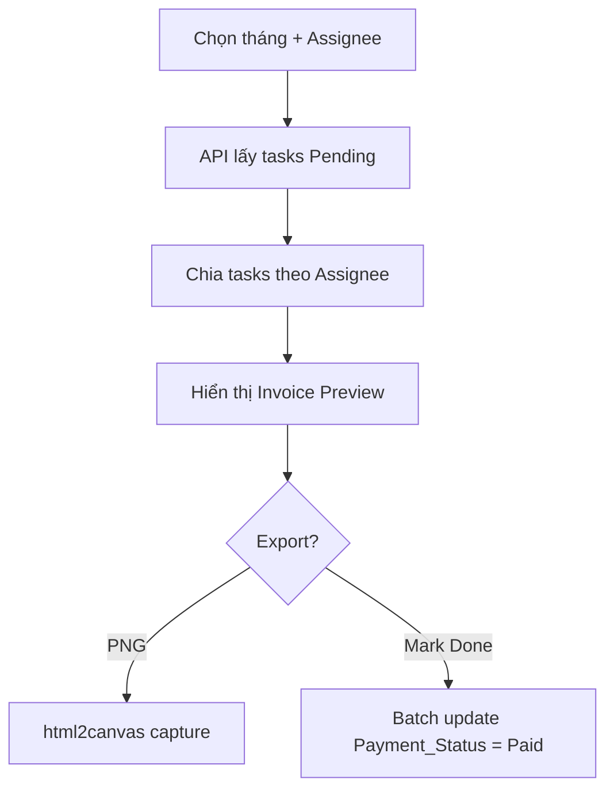

# Monthly Invoice / Payment Summary Feature

Tạo chức năng tổng hợp hoá đơn hàng tháng cho mỗi Assignee, hiển thị các task còn Pending, tính tổng tiền, và cho phép export hình ảnh để gửi đối soát.

## Luồng hoạt động



**Logic lọc dữ liệu:**
- Lấy tất cả tasks có `Payment_Status = Unpaid`
- Nếu task có `Closed_Date` thuộc tháng đang chọn → hiển thị
- Nếu task của tháng trước mà vẫn `Unpaid` → **cộng dồn** vào tháng hiện tại
- Nhóm theo Assignee → mỗi Assignee = 1 invoice

## Proposed Changes

### Backend API

#### [MODIFY] [api.js](file:///e:/TDC_App/TDGAMES_App/Sync_Slack_Discord_ClickUp_Drive/src/api.js)

Thêm 1 route mới:

- **GET `/api/pm-tracking/invoice`** — Query params: `month` (YYYY-MM), `assignee` (optional)
  - Trả về tasks nhóm theo Assignee, chỉ lấy `Payment_Status = Unpaid`
  - Filter: `Closed_Date <= end of selected month` (tasks đã closed đến hết tháng đó)
  - Ngoài ra cũng lấy luôn task không có Closed_Date mà Unpaid (chưa closed nhưng đã có cost)
  - Response format:
    ```json
    {
      "invoices": {
        "NgocAnh_TDGames": {
          "tasks": [...],
          "totalCost": 500,
          "totalBonus": 50,
          "grandTotal": 550,
          "currency": "USD"
        }
      },
      "month": "2026-03"
    }
    ```

- **POST `/api/pm-tracking/invoice/mark-paid`** — Body: `{ taskIds: [1, 2, 3] }`
  - Batch update Payment_Status → Paid cho tất cả task trong invoice sau khi đã thanh toán

---

### Frontend UI

#### [MODIFY] [index.html](file:///e:/TDC_App/TDGAMES_App/Sync_Slack_Discord_ClickUp_Drive/public/index.html)

Thêm section **Invoice Generator** vào trang PM Tracking, đặt sau Task Data card:

```
┌──────────────────────────────────────────────┐
│ 💰 Monthly Invoice                           │
│ ┌────────┐ ┌──────────────┐ ┌──────────────┐│
│ │Mar 2026│ │All Assignees │ │Generate      ││
│ └────────┘ └──────────────┘ └──────────────┘│
├──────────────────────────────────────────────┤
│ Invoice Preview (per assignee):              │
│ ┌──────────────────────────────────────────┐ │
│ │  INVOICE — NgocAnh_TDGames               │ │
│ │  Period: March 2026 (+ overdue)          │ │
│ │  ──────────────────────────────────────  │ │
│ │  # │ Task Name      │ Cost  │ Bonus     │ │
│ │  1 │ Tasmanian D... │ $100  │ $10       │ │
│ │  2 │ Duck Dodgers   │ $50   │ —         │ │
│ │  ──────────────────────────────────────  │ │
│ │  Subtotal Cost:   $150                   │ │
│ │  Subtotal Bonus:  $10                    │ │
│ │  GRAND TOTAL:     $160                   │ │
│ └──────────────────────────────────────────┘ │
│ [📸 Export PNG]  [✅ Mark All Paid]           │
└──────────────────────────────────────────────┘
```

#### [MODIFY] [app.js](file:///e:/TDC_App/TDGAMES_App/Sync_Slack_Discord_ClickUp_Drive/public/app.js)

Thêm functions:

| Function | Mô tả |
|----------|--------|
| `generateInvoice()` | Call API, render invoice preview cho mỗi assignee |
| `exportInvoicePNG()` | Dùng `html2canvas` capture div invoice → download PNG |
| `markInvoicePaid(taskIds)` | POST mark-paid, refresh lại |

#### [MODIFY] [index.css](file:///e:/TDC_App/TDGAMES_App/Sync_Slack_Discord_ClickUp_Drive/public/index.css)

Thêm styles cho invoice card: `.invoice-card`, `.invoice-header`, `.invoice-table`, `.invoice-total`

---

### Dependencies

- **html2canvas** — Load từ CDN `<script>`, không cần npm install. Dùng để capture invoice div → PNG image

## Verification Plan

### Browser test
1. Chọn tháng, bấm Generate → hiển thị invoice grouped by assignee
2. Kiểm tra logic cộng dồn: task tháng trước Pending → xuất hiện trong invoice tháng này
3. Bấm Export PNG → download file ảnh invoice
4. Bấm Mark All Paid → tất cả task chuyển sang Done, invoice rỗng
