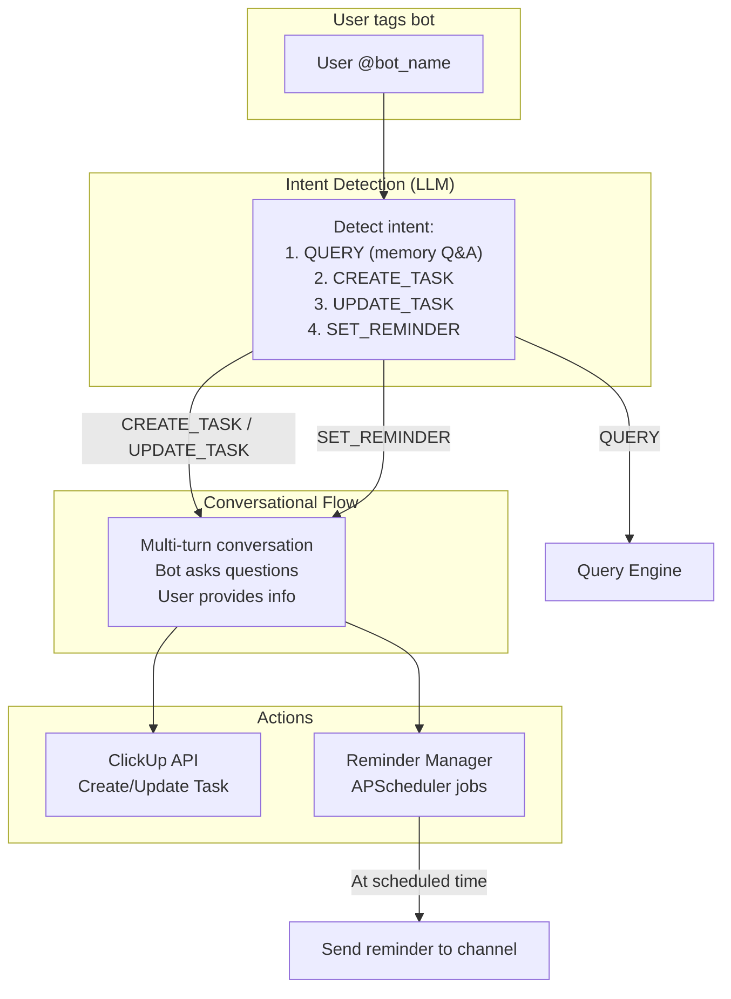

# Phase 9: ClickUp Task Manager & Reminder System

Bots sẽ có thêm khả năng **tạo task trên ClickUp** và **nhắc hẹn/cron job**.

## Architecture



## ClickUp Structure

```
TD_Workspace (Space)
  └─ Bot_Manager (Folder)
       ├─ TD_CTO (List) ← tasks created by TD_CTO bot
       ├─ TD_CEO (List) ← tasks created by TD_CEO bot
       ├─ TD_PM  (List)
       ├─ TD_HRM (List)
       └─ TD_CFO (List)
```

Each list needs two custom fields:
- **Assignee Name** (text): Name of the person handling the task
- **Assignee ID** (text): Discord/Slack user ID for mention/reminder

## Proposed Changes

---

### ClickUp Client

#### [NEW] [core/clickup_client.py](file:///e:/TDC_App/TDGAMES_App/Sync_Qdrant/core/clickup_client.py)

ClickUp API v2 wrapper:

| Method | ClickUp API | Purpose |
|--------|-------------|---------|
| `create_task(list_id, name, description, due_date, start_date, custom_fields)` | `POST /list/{id}/task` | Create task with custom fields |
| `update_task(task_id, status, due_date, ...)` | `PUT /task/{id}` | Update status/dates |
| `get_task(task_id)` | `GET /task/{id}` | Get task details |
| `get_list_tasks(list_id)` | `GET /list/{id}/task` | List tasks |
| `set_custom_field(task_id, field_id, value)` | `POST /task/{id}/field/{id}` | Set assignee fields |

---

### Intent Detection & Conversation Manager

#### [NEW] [core/intent_detector.py](file:///e:/TDC_App/TDGAMES_App/Sync_Qdrant/core/intent_detector.py)

LLM-based intent classification:

```
Intents:
  QUERY        → forward to query_engine (existing)
  CREATE_TASK  → start task creation flow
  UPDATE_TASK  → update existing task (done/pending/reschedule)
  SET_REMINDER → start reminder creation flow
```

#### [NEW] [core/conversation_manager.py](file:///e:/TDC_App/TDGAMES_App/Sync_Qdrant/core/conversation_manager.py)

Multi-turn conversation state machine per user+bot:

**Task Creation Flow:**
```
1. Bot detects CREATE_TASK intent
2. Bot asks: "Task name?"
3. User replies → Bot asks: "Description?"
4. User replies → Bot asks: "Who handles this? (tag or name)"
5. User replies → Bot asks: "Start date?"
6. User replies → Bot asks: "Deadline?"
7. User replies → Bot shows summary + confirm
8. User confirms → Create on ClickUp
```

**Reminder Flow:**
```
1. Bot detects SET_REMINDER intent
2. Bot asks: "What to remind?"
3. User replies → Bot asks: "When? (date/time)"
4. User replies → Bot asks: "Repeat? (once/daily/weekly)"
5. User replies → Bot shows summary + confirm
6. User confirms → Schedule reminder
```

State stored in SQLite with timeout (auto-cancel after 10 min inactive).

---

### Reminder Manager

#### [NEW] [core/reminder_manager.py](file:///e:/TDC_App/TDGAMES_App/Sync_Qdrant/core/reminder_manager.py)

- SQLite table `reminders`: id, role_id, user_id, platform, channel_id, message, cron_expr, next_run, repeat_type, is_active
- On startup: load all active reminders → add to APScheduler
- Send reminder message to the original channel, tagging the user
- After one-time reminder fires, mark inactive

---

### Bot Updates

#### [MODIFY] [bots/discord_bot.py](file:///e:/TDC_App/TDGAMES_App/Sync_Qdrant/bots/discord_bot.py)

- On @mention: pass to `IntentDetector` instead of directly to `QueryEngine`
- If intent is `CREATE_TASK`/`SET_REMINDER`: start conversation flow
- Track reply context via Discord message reference (threaded replies)

#### [MODIFY] [bots/slack_bot.py](file:///e:/TDC_App/TDGAMES_App/Sync_Qdrant/bots/slack_bot.py)

- Same intent detection on `app_mention`
- Use Slack threads for conversation flow (all replies in same thread)

---

### Config Updates

#### [MODIFY] [.env.example](file:///e:/TDC_App/TDGAMES_App/Sync_Qdrant/.env.example)

```env
# ---- ClickUp ----
CLICKUP_API_TOKEN=pk_your_clickup_api_token
```

#### [MODIFY] [config/bot_roles.yaml](file:///e:/TDC_App/TDGAMES_App/Sync_Qdrant/config/bot_roles.yaml)

Each role gets a `clickup_list_id`:
```yaml
TD_CTO:
  clickup_list_id: "900123456789"
  # ... existing fields
```

---

### Admin UI Updates

#### [MODIFY] [admin/static/app.js](file:///e:/TDC_App/TDGAMES_App/Sync_Qdrant/admin/static/app.js)

- New "Reminders" page in sidebar → view/manage scheduled reminders
- Roles table shows ClickUp list ID status

## Verification Plan

### Manual Testing
- Tag bot on Discord → ask to create task → verify conversation flow → check ClickUp
- Tag bot → ask for reminder → verify it fires at scheduled time
- Tag bot → ask to update task status → verify ClickUp changes
