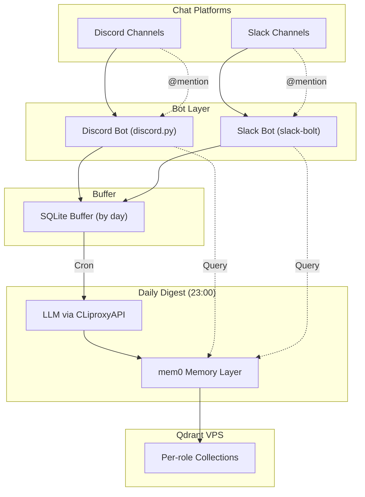

# TD Games Memory Database - Walkthrough

## What Was Built

A complete **Memory Database System** for TD Games that uses Discord & Slack bots to listen to company chat channels, summarize important information daily via LLM, and store structured memories in Qdrant via mem0.

## Architecture

## Files Created (15 files)

| File | Purpose |
|------|---------|
| [requirements.txt](file:///e:/TDC_App/TDGAMES_App/Sync_Qdrant/requirements.txt) | Python dependencies |
| [.env.example](file:///e:/TDC_App/TDGAMES_App/Sync_Qdrant/.env.example) | Environment template (CLiproxyAPI, Qdrant, schedule) |
| [config/settings.py](file:///e:/TDC_App/TDGAMES_App/Sync_Qdrant/config/settings.py) | Pydantic settings + per-role token resolver |
| [config/bot_roles.yaml](file:///e:/TDC_App/TDGAMES_App/Sync_Qdrant/config/bot_roles.yaml) | 5 roles (CTO/CEO/PM/HRM/CFO) with system & digest prompts |
| [core/memory_engine.py](file:///e:/TDC_App/TDGAMES_App/Sync_Qdrant/core/memory_engine.py) | mem0 + Qdrant per-role collection management |
| [core/message_buffer.py](file:///e:/TDC_App/TDGAMES_App/Sync_Qdrant/core/message_buffer.py) | SQLite buffer with date grouping & processed tracking |
| [core/daily_digest.py](file:///e:/TDC_App/TDGAMES_App/Sync_Qdrant/core/daily_digest.py) | LLM summarization pipeline, noise filtering |
| [core/query_engine.py](file:///e:/TDC_App/TDGAMES_App/Sync_Qdrant/core/query_engine.py) | Memory search + LLM response generation |
| [bots/discord_bot.py](file:///e:/TDC_App/TDGAMES_App/Sync_Qdrant/bots/discord_bot.py) | Discord.py bot — multi-server, mention handler |
| [bots/slack_bot.py](file:///e:/TDC_App/TDGAMES_App/Sync_Qdrant/bots/slack_bot.py) | Slack Bolt bot — Socket Mode, threaded replies |
| [scheduler/jobs.py](file:///e:/TDC_App/TDGAMES_App/Sync_Qdrant/scheduler/jobs.py) | APScheduler with daily digest + weekly cleanup |
| [main.py](file:///e:/TDC_App/TDGAMES_App/Sync_Qdrant/main.py) | Entry point — starts all bots + scheduler |
| [scripts/setup_qdrant_collections.py](file:///e:/TDC_App/TDGAMES_App/Sync_Qdrant/scripts/setup_qdrant_collections.py) | One-time Qdrant collection setup |
| [scripts/manual_digest.py](file:///e:/TDC_App/TDGAMES_App/Sync_Qdrant/scripts/manual_digest.py) | CLI to manually trigger digest |
| [Dockerfile](file:///e:/TDC_App/TDGAMES_App/Sync_Qdrant/Dockerfile) + [docker-compose.yml](file:///e:/TDC_App/TDGAMES_App/Sync_Qdrant/docker-compose.yml) | Production deployment |

## Key Design Decisions

1. **Strategy A (separate tokens)**: Each bot role has its own Discord App + Slack App → cleanest multi-server experience, each bot has its own identity/avatar
2. **Daily Digest over Realtime**: Messages buffered in SQLite → LLM summarizes at 23:00 → only important info stored in Qdrant. Filters noise with `NO_IMPORTANT_INFO` response
3. **Extensible roles**: Add new roles by editing `bot_roles.yaml` + setting env tokens — no code changes
4. **Token convention**: `{ROLE_ID}_{PLATFORM}_TOKEN` (e.g., `TD_CTO_DISCORD_TOKEN`)

## Next Steps to Deploy

1. Copy `.env.example` → `.env`, fill in CLiproxyAPI URL and API key
2. Create Discord Bot Apps → enable **Message Content Intent** → get tokens
3. Create Slack Apps → enable **Socket Mode** → get bot + app tokens
4. Set all tokens as env vars
5. Run `python -m scripts.setup_qdrant_collections`
6. Run `python main.py` (or `docker-compose up -d`)
