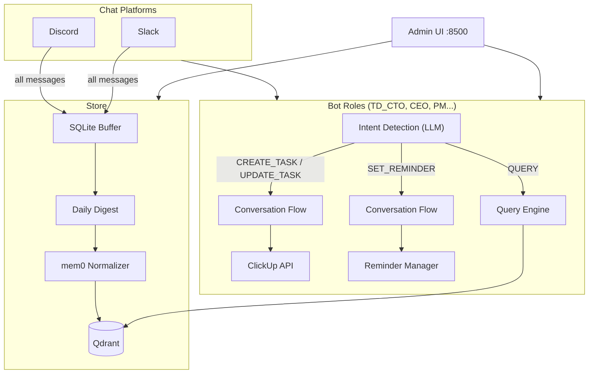

# TD Games Memory Database - Walkthrough

## Admin UI - Live Screenshot


## Architecture



## Key Files (24 total)

| File | Purpose |
|------|---------|
| `main.py` | Entry point: starts bots, scheduler, admin, ClickUp, reminders |
| `config/settings.py` | Settings: LLM, Embedder, Qdrant, ClickUp |
| `config/bot_roles.yaml` | 5 roles with prompts + `clickup_list_id` |
| `.env.example` | All env vars including ClickUp token |
| `core/memory_engine.py` | mem0 + Qdrant integration |
| `core/message_buffer.py` | SQLite raw message buffer |
| `core/daily_digest.py` | AI daily summarization |
| `core/query_engine.py` | Semantic search + LLM answers |
| `core/clickup_client.py` | **[NEW]** ClickUp API v2 async wrapper |
| `core/intent_detector.py` | **[NEW]** LLM-based intent classifier |
| `core/conversation_manager.py` | **[NEW]** Multi-turn conversation state machine |
| `core/reminder_manager.py` | **[NEW]** APScheduler reminder system |
| `bots/discord_bot.py` | Discord bot with intent + conversations |
| `bots/slack_bot.py` | Slack bot with intent + conversations |
| `scheduler/jobs.py` | APScheduler cron jobs |
| `admin/api.py` | FastAPI backend (7 endpoint groups) |
| `admin/static/index.html` | SPA shell with 7 nav items |
| `admin/static/styles.css` | Dark OLED design system |
| `admin/static/app.js` | Frontend logic with 7 pages |
| `requirements.txt` | Dependencies |
| `Dockerfile`, `docker-compose.yml` | Containerization |

## Phase 9: ClickUp + Reminders (New)

### How It Works

1. **User @tags bot** on Discord/Slack
2. **Intent Detector** (LLM) classifies: `QUERY`, `CREATE_TASK`, `UPDATE_TASK`, or `SET_REMINDER`
3. If task/reminder:
   - **Conversation Manager** starts multi-step Q&A (name, description, assignee, deadline...)
   - Pre-fills info extracted by intent detector
   - Shows summary → user confirms
4. **ClickUp Client** creates/updates task via API with custom fields
5. **Reminder Manager** schedules via APScheduler (once/daily/weekly)

### Setup Required

```env
# .env
CLICKUP_API_TOKEN=pk_your_token_here
```

```yaml
# bot_roles.yaml - per role
TD_CTO:
  clickup_list_id: "900123456789"
```
