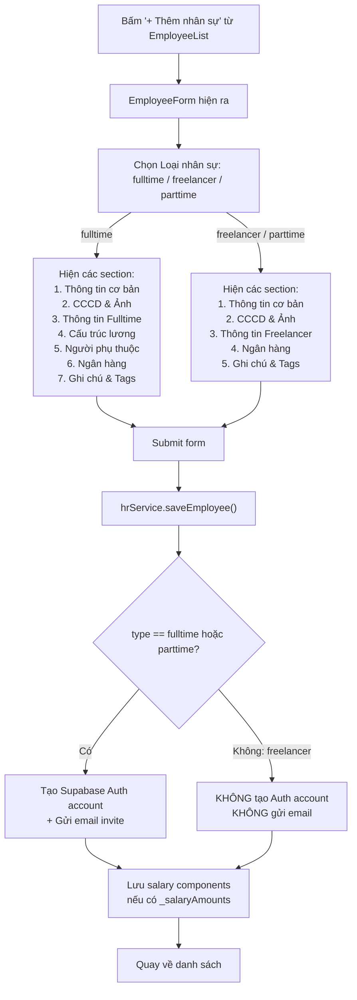

# Phân Tích Luồng Tạo Nhân Sự — Freelancer vs Fulltime vs Parttime

## Tổng Quan

Hiện tại hệ thống có **2 cách** tạo nhân sự:

| Cách tạo | File | Mô tả |
|---|---|---|
| **Quick Add** | [QuickAddEmployee.tsx](file:///e:/TDC_App/TDGAMES_App/td-games-invoice-app/apps/hr/components/QuickAddEmployee.tsx) | Chỉ tạo **fulltime**, không hỗ trợ freelancer/parttime |
| **Full Form** | [EmployeeForm.tsx](file:///e:/TDC_App/TDGAMES_App/td-games-invoice-app/apps/hr/components/EmployeeForm.tsx) | Hỗ trợ cả 3 loại, chọn qua dropdown "Loại nhân sự" |

---

## Luồng Tạo Qua Full Form (EmployeeForm)



---

## ⚠️ Vấn Đề: Freelancer và Parttime Đang Bị Đối Xử Giống Nhau

### 1. UI Form — Cùng section, cùng label

Trong [EmployeeForm.tsx:761](file:///e:/TDC_App/TDGAMES_App/td-games-invoice-app/apps/hr/components/EmployeeForm.tsx#L760-L821):

```tsx
// freelancer VÀ parttime dùng CÙNG MỘT section UI
{(form.type === 'freelancer' || form.type === 'parttime') && (
  <div>
    <h3>🌍 Thông tin Freelancer</h3>   // ← Luôn ghi "Freelancer" dù là parttime
    // Portfolio URL, Chức danh, Múi giờ, Loại rate, Mức giá, Thanh toán, Chuyên môn
  </div>
)}
```

### 2. Required Fields — Giống nhau cho cả 2

Trong [EmployeeForm.tsx:71-88](file:///e:/TDC_App/TDGAMES_App/td-games-invoice-app/apps/hr/components/EmployeeForm.tsx#L71-L88), required fields chỉ phân biệt `fulltime` vs "còn lại":
- **Fulltime**: Yêu cầu thêm `id_issue_date`, `id_issue_place`, `department_id`, `position`, `start_date`
- **Freelancer/Parttime**: Chỉ yêu cầu basic fields, không phân biệt

### 3. Auth — Parttime có auth, Freelancer không

Trong [hrService.ts:33](file:///e:/TDC_App/TDGAMES_App/td-games-invoice-app/apps/hr/services/hrService.ts#L32-L61):
```ts
// CHỈ tạo auth cho fulltime + parttime
if (data.work_email && (data.type === 'fulltime' || data.type === 'parttime')) {
  // → Gửi invite email, tạo Supabase Auth account
}
// Freelancer: KHÔNG tạo account, KHÔNG gửi email
```

### 4. Salary Structure — Chỉ Fulltime

Section "Cấu trúc lương" và "Người phụ thuộc" chỉ hiển thị khi `type === 'fulltime'`.

### 5. Quick Add — Chỉ Fulltime

`QuickAddEmployee` luôn hardcode `type: 'fulltime'`, không có lựa chọn freelancer/parttime.

---

## Bảng So Sánh Chi Tiết

| Feature | Fulltime | Parttime | Freelancer |
|---|:---:|:---:|:---:|
| **Form riêng Quick Add** | ✅ | ❌ | ❌ |
| **Tạo Supabase Auth** | ✅ | ✅ | ❌ |
| **Gửi email invite** | ✅ | ✅ | ❌ |
| **Section Fulltime** (phòng ban, MST, BHXH...) | ✅ | ❌ | ❌ |
| **Section Freelancer** (portfolio, rate, timezone...) | ❌ | ✅ ⚠️ Dùng chung | ✅ |
| **Cấu trúc lương (salary components)** | ✅ | ❌ | ❌ |
| **Người phụ thuộc** | ✅ | ❌ | ❌ |
| **Required: department_id, position, start_date** | ✅ | ❌ | ❌ |
| **Required: id_issue_date, id_issue_place** | ✅ | ❌ | ❌ |

---

## Kết Luận

> **Freelancer và Parttime hiện tại gần như giống hệt nhau** — dùng cùng UI section, cùng fields, cùng required validation. Điểm khác duy nhất là **parttime được tạo Auth account + gửi invite email**, còn **freelancer thì không**.

Nếu anh muốn freelancer khác biệt rõ ràng hơn so với fulltime/parttime, cần xác định:

1. **Freelancer cần/không cần những fields nào?** (VD: parttime có thể cần department + start_date, freelancer thì không)
2. **Freelancer có cần đăng nhập Employee Portal không?** (hiện tại: KHÔNG)
3. **Freelancer có liên kết với module Workforce (thanh toán per task) không?** (hiện tại module Workforce có `Worker` type riêng, CHƯA link với `HrEmployee`)
4. **Parttime cần section riêng không?** (hiện tại parttime dùng form "Freelancer" — label sai)
