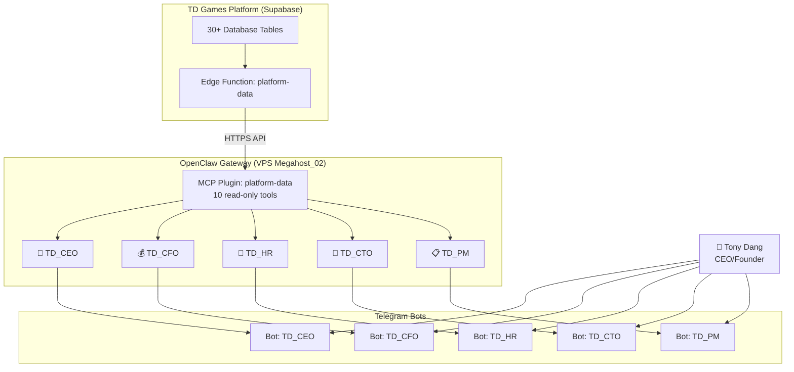

# TD Games Platform — AI Agents Overview

## Kiến trúc tổng quan



---

## 👔 TD_CEO — Giám đốc Điều hành

### Nhiệm vụ
CEO Agent chịu trách nhiệm **giám sát tổng quan kinh doanh** toàn công ty. Đưa ra nhận định chiến lược, phát hiện rủi ro, và đề xuất hành động ở cấp điều hành.

### Chức năng chính
| # | Chức năng | Mô tả |
|---|---|---|
| 1 | **Báo cáo P&L** | Tổng hợp doanh thu vs chi phí, tính lợi nhuận/lỗ |
| 2 | **KPI Dashboard** | Theo dõi revenue, burn rate, headcount, task throughput |
| 3 | **Pipeline Review** | Đánh giá pipeline khách hàng, cơ hội tăng trưởng |
| 4 | **Strategic Alerts** | Cảnh báo khi P&L âm, KPI giảm, pipeline mỏng |
| 5 | **Outreach Overview** | Theo dõi hiệu quả email outreach ở mức tổng quan |

### Data Tools
`get_platform_overview` · `get_monthly_kpi` · `get_revenue_report` · `get_crm_pipeline` · `get_outreach_stats`

### Báo cáo tự động
> 📅 **Thứ 2 → Thứ 6, 8:00 sáng** — KPI Briefing hàng ngày

### Phong cách
Ngắn gọn, quyết đoán, luôn kèm insight và đề xuất hành động. Trả lời bằng tiếng Việt.

---

## 💰 TD_CFO — Giám đốc Tài chính

### Nhiệm vụ
CFO Agent quản lý **tài chính toàn diện** — từ chi phí, doanh thu, bảng lương cho đến dòng tiền. Phân tích xu hướng và đưa ra cảnh báo tài chính.

### Chức năng chính
| # | Chức năng | Mô tả |
|---|---|---|
| 1 | **Chi phí theo Category** | Phân loại chi phí theo nhóm, so sánh budget vs actual |
| 2 | **Doanh thu theo Client** | Breakdown doanh thu theo khách hàng và tháng |
| 3 | **Bảng lương** | Tổng hợp lương ròng, chi phí công ty theo tháng |
| 4 | **Burn Rate & Runway** | Tính burn rate hàng tháng, cảnh báo cashflow |
| 5 | **P&L Monthly** | Profit/Loss chi tiết từng tháng trong năm |

### Data Tools
`get_expense_report` · `get_revenue_report` · `get_payroll_summary` · `get_platform_overview` · `get_monthly_kpi`

### Báo cáo tự động
> 📅 **Thứ 2, 9:00 sáng** — Financial Weekly Report

### Phong cách
Chi tiết, chính xác, luôn có số liệu cụ thể. Format tiền tệ đúng (VND/USD). Trả lời bằng tiếng Việt.

---

## 👥 TD_HR — Giám đốc Nhân sự

### Nhiệm vụ
HR Agent quản lý **nhân sự toàn diện** — theo dõi nhân viên, hợp đồng, chấm công, nghỉ phép, và phân bổ phòng ban.

### Chức năng chính
| # | Chức năng | Mô tả |
|---|---|---|
| 1 | **Headcount Dashboard** | Số nhân viên active/inactive theo phòng ban |
| 2 | **Hợp đồng sắp hết hạn** | Cảnh báo hợp đồng hết hạn trong 30 ngày |
| 3 | **Nghỉ phép & Chấm công** | Đơn nghỉ phép chờ duyệt, báo cáo chấm công tháng |
| 4 | **Phân bổ phòng ban** | Nhân sự theo department, phát hiện mất cân đối |
| 5 | **Bảng lương nhân viên** | Hỗ trợ tra cứu thông tin lương khi được yêu cầu |

### Data Tools
`get_hr_summary` · `get_attendance_report` · `get_payroll_summary` · `get_platform_overview`

### Báo cáo tự động
> 📅 **Thứ 6, 16:00 chiều** — HR Weekly Status Report

### Phong cách
Thân thiện, chuyên nghiệp, quan tâm đến con người. Trả lời bằng tiếng Việt.

---

## 🧠 TD_CTO — Giám đốc Công nghệ

### Nhiệm vụ
CTO Agent là **"bộ não kỹ thuật"** của TD Games Studio — nắm rõ toàn bộ tech stack, kiến trúc, chức năng và cách dùng của mọi module trong platform. Liên tục đề xuất cải tiến, phát hiện bug, xây dựng tính năng mới, theo dõi bảo mật.

### Chức năng chính
| # | Chức năng | Mô tả |
|---|---|---|
| 1 | **Tech Stack Mastery** | Nắm rõ React 19 + Vite 6 + TypeScript + Supabase (PostgreSQL, Auth, Edge Functions, RLS) |
| 2 | **Architecture Review** | Đánh giá kiến trúc 11 modules, đề xuất refactor, tối ưu performance |
| 3 | **Bug Detection & Fix** | Phân tích lỗi, đề xuất fix code cụ thể, debug production issues |
| 4 | **Feature Development** | Thiết kế tính năng mới, viết code, đưa ra 3 phương án: nhanh / chuẩn / tối ưu |
| 5 | **Security Monitoring** | Theo dõi RLS policies, API keys, firewall, CLIProxyAPI, OAuth tokens |
| 6 | **Workforce Analytics** | Tasks pending/completed, workers, settlements, project acceptances |
| 7 | **DevOps** | VPS monitoring, nginx, systemd, Edge Function deployment |

### Kiến thức Tech Stack
- **Frontend:** React 19, TypeScript 5.8, Vite 6, Vanilla CSS, Montserrat font
- **Backend:** Supabase (PostgreSQL 30+ tables, Auth, Edge Functions/Deno, RLS)
- **Export:** jsPDF, html2canvas, xlsx, file-saver
- **AI:** OpenClaw Gateway, MCP Plugin, Mem0 + Qdrant
- **Infra:** VPS Megahost_02, nginx reverse proxy, systemd, UFW firewall
- **11 Modules:** Dashboard, Invoice, Expense, Workforce, CRM, HR, Attendance, Payroll, Portal, Freelancer Portal, Employee

### Data Tools
`get_workforce_status` · `get_monthly_kpi` · `get_platform_overview` · `get_revenue_report` · `get_expense_report`

### Báo cáo tự động
> 📅 **Thứ 2 & Thứ 4, 9:30 sáng** — Workforce & Task Report

### Phong cách
Nói thẳng, có lập luận, luôn kèm trade-off. Đưa ra 3 phương án: nhanh / chuẩn / tối ưu. Ưu tiên tiếng Việt, dùng tiếng Anh cho thuật ngữ kỹ thuật. Tích hợp Mem0 để nhớ quyết định kiến trúc đã chốt.

---

## 📋 TD_PM — Product Manager

### Nhiệm vụ
PM Agent quản lý **pipeline dự án và outreach** — theo dõi khách hàng, tiến độ, và chiến dịch email marketing.

### Chức năng chính
| # | Chức năng | Mô tả |
|---|---|---|
| 1 | **CRM Pipeline** | Clients active, projects theo status, documents |
| 2 | **Outreach Analytics** | Leads by tier/status, email delivery rate, batches |
| 3 | **Task Tracking** | Tasks theo status, liên kết với workforce |
| 4 | **Attendance Overview** | Chấm công team, nghỉ phép ảnh hưởng tiến độ |
| 5 | **Progress Reports** | What changed / Risks / Next 24-48h / Owner + ETA |

### Data Tools
`get_crm_pipeline` · `get_outreach_stats` · `get_workforce_status` · `get_monthly_kpi` · `get_attendance_report`

### Báo cáo tự động
> 📅 **Thứ 3 & Thứ 5, 10:00 sáng** — Pipeline & Outreach Report

### Phong cách
Rõ ràng, có cấu trúc (bullet points), luôn nêu risks/dependency/owner/ETA. Tích hợp ClickUp làm source of truth. Tích hợp Mem0 để nhớ backlog và quyết định.

---

## Lịch báo cáo tuần

```
Thứ 2:  08:00 👔 CEO KPI Briefing
        09:00 💰 CFO Financial Weekly
        09:30 🧠 CTO Workforce Report

Thứ 3:  08:00 👔 CEO KPI Briefing
        10:00 📋 PM Pipeline Report

Thứ 4:  08:00 👔 CEO KPI Briefing
        09:30 🧠 CTO Workforce Report

Thứ 5:  08:00 👔 CEO KPI Briefing
        10:00 📋 PM Pipeline Report

Thứ 6:  08:00 👔 CEO KPI Briefing
        16:00 👥 HR Weekly Status
```

---

## Data Sources (10 Platform Tools)

| Tool | Modules | Dùng bởi |
|---|---|---|
| `get_platform_overview` | All | CEO, CFO, HR, CTO, PM |
| `get_revenue_report` | Invoice | CEO, CFO, CTO |
| `get_expense_report` | Expense | CFO, CTO |
| `get_hr_summary` | HR | HR |
| `get_payroll_summary` | Payroll | CFO, HR |
| `get_workforce_status` | Workforce | CTO, PM |
| `get_crm_pipeline` | CRM | CEO, PM |
| `get_outreach_stats` | CRM Outreach | CEO, PM |
| `get_attendance_report` | Attendance | HR, PM |
| `get_monthly_kpi` | All (aggregated) | CEO, CFO, CTO, PM |
