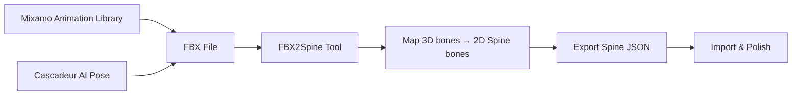
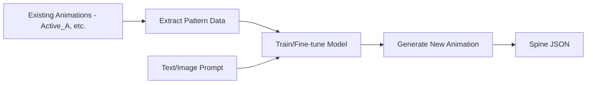
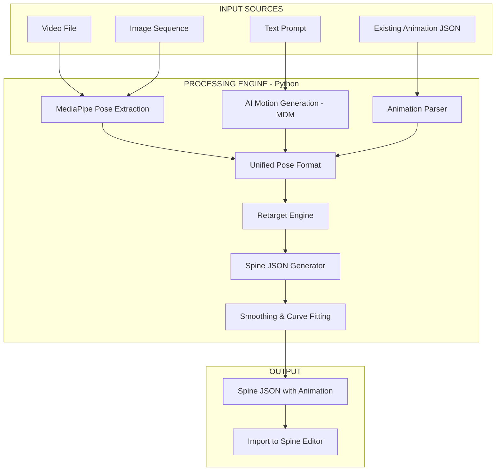

# 🎭 Auto Animation cho Spine 2D — Nghiên Cứu Các Phương Án Khả Thi

## Phân Tích Skeleton Hiện Tại

File `Rig_Base.json` của bạn sử dụng **Spine 4.2.39** với cấu trúc rất chuyên nghiệp:

| Thành phần | Chi tiết |
|:---|:---|
| **Bones** | ~49 bones (root → All → DeathScaler → Pelvis → Body chain) |
| **Hierarchy** | Spine → Torso → Neck → Head (Near/Far symmetry cho tay & chân) |
| **IK Constraints** | 6 IK chains (IK_legFar, IK_legNear, IK_ballFar, IK_ballNear, IK_toeFar, IK_toeNear) |
| **Transform Constraints** | 4 (CBFtoChestTurn, CBNtoChestTurn, ChestTurn, FaceTurn) |
| **Existing Animation** | `Active_A` (~2.8s, với Bézier curves) |
| **Control Bones** | CTRL_footNear, CTRL_footFar, ChestTurn, FaceTurn |

> [!IMPORTANT]
> Skeleton này có **IK constraints** và **Transform constraints** phức tạp. Điều này rất quan trọng vì khi tạo animation tự động, ta cần animate **control bones** (CTRL_footNear, CTRL_footFar, Pelvis...) thay vì animate trực tiếp các bone bị ràng buộc IK.

---

## 5 Phương Án Khả Thi

### ⭐ Phương Án 1: Video Mocap → MediaPipe → Spine JSON (KHẢ THI CAO NHẤT)

**Pipeline:**


**Cách hoạt động:**
1. Quay hoặc tìm video animation reference (VD: walk cycle, attack, idle)
2. Dùng **MediaPipe Pose** (Google) extract 33 body landmarks per frame
3. **Custom Python script** chuyển đổi:
   - MediaPipe keypoints → tính **rotation angles** cho từng bone
   - Map sang bone hierarchy của Rig_Base (Pelvis, Waist, Torso, bicepNear, thighNear, etc.)
   - Tính IK targets cho CTRL_footNear/CTRL_footFar
   - Export trực tiếp vào format Spine JSON
4. Import animation vào Spine Editor → tinh chỉnh

**Ưu điểm:**
- ✅ **Hoàn toàn miễn phí** (MediaPipe + Python là open source)
- ✅ **Tự động hóa cao** — chỉ cần video input
- ✅ **Linh hoạt** — dùng bất kỳ video nào (YouTube, record, etc.)
- ✅ **Có thể custom** — chỉnh mapping cho chính xác Rig_Base

**Nhược điểm:**
- ⚠️ Cần viết script mapping từ MediaPipe landmarks → Spine bone rotations
- ⚠️ Phải xử lý noise/jitter (cần smoothing filter)
- ⚠️ Translation 3D→2D mất depth info
- ⚠️ Cần manual polish trong Spine Editor

**Đánh giá khả thi: 🟢🟢🟢🟢🟡 (4/5)**

**Thư viện cần dùng:**
```
pip install opencv-python mediapipe numpy spine-json-lib
```

---

### ⭐ Phương Án 2: Mixamo/Cascadeur → FBX → FBX2Spine

**Pipeline:**


**Cách hoạt động:**
1. Tải animation miễn phí từ **Mixamo** (Adobe) — hàng ngàn animations sẵn có
2. Hoặc tạo animation mới bằng **Cascadeur** (AI-assisted physics-based animation)
3. Export dưới dạng **FBX**
4. Dùng **FBX2Spine** (tool trên Steam/Itch.io) để map 3D skeleton → 2D Rig_Base
5. Xuất animation data → Import vào Spine

**Ưu điểm:**
- ✅ **Kho animation khổng lồ** từ Mixamo (walk, run, attack, idle, jump...)
- ✅ **AI-assisted** qua Cascadeur (physics-based, tự tính body mechanics)
- ✅ **FBX2Spine** đã được community sử dụng nhiều
- ✅ Có thể **save preset** mapping, tái sử dụng cho nhiều animations

**Nhược điểm:**
- ⚠️ FBX2Spine có giá (Steam/Itch.io)
- ⚠️ Cascadeur Pro cần license để export FBX
- ⚠️ 3D→2D projection gây mất thông tin chiều sâu
- ⚠️ Cần cleanup thủ công khá nhiều
- ⚠️ Learning curve cho FBX2Spine mapping

**Đánh giá khả thi: 🟢🟢🟢🟡🟡 (3.5/5)**

---

### ⭐ Phương Án 3: AI Text-to-Motion → Retarget → Spine

**Pipeline:**


**Các model AI hiện có:**

| Model | Loại | Input | Output |
|:---|:---|:---|:---|
| **MDM** (Motion Diffusion Model) | Diffusion | Text prompt | 3D joint positions |
| **MoMask** | VQ-VAE + Transformer | Text prompt | 3D motion sequences |
| **T2M-GPT** | GPT-style | Text prompt | 3D motion tokens |
| **MLD** (Motion Latent Diffusion) | Latent Diffusion | Text prompt | 3D motion |

**Cách hoạt động:**
1. Nhập text mô tả animation (VD: "a person swinging a sword aggressively")
2. Model AI tạo ra 3D motion sequences (SMPL format, 22-24 joints)
3. Project 3D joints xuống 2D plane (side view)
4. Retarget 2D joint positions → bone rotations cho Rig_Base
5. Generate Spine JSON animation data

**Ưu điểm:**
- ✅ **Đầu vào là text** — cực kỳ linh hoạt
- ✅ **Các model đều open-source** (GitHub)
- ✅ Có thể tạo animation chưa tồn tại
- ✅ Research đang phát triển rất nhanh

**Nhược điểm:**
- ⚠️ Output là 3D SMPL → cần post-processing phức tạp để về 2D Spine
- ⚠️ Cần GPU mạnh (inference)
- ⚠️ Quality chưa ổn định cho production
- ⚠️ Cần retarget pipeline riêng (mapping SMPL joints → Spine bones)
- ⚠️ Setup kỹ thuật phức tạp

**Đánh giá khả thi: 🟢🟢🟡🟡🟡 (2.5/5)** — Tiềm năng cao nhưng phức tạp

---

### ⭐ Phương Án 4: Animation Transfer Learning (Học từ animations có sẵn)

**Pipeline:**


**Cách hoạt động:**
1. Parse tất cả animations hiện có trong Rig_Base (Active_A, ...)
2. Extract patterns: timing, curves, bone rotation ranges, movement style
3. Dùng machine learning (LSTM / Transformer) để học "phong cách" animation
4. Input: text description hoặc ảnh reference → Generate animation mới theo style đã học

**Ưu điểm:**
- ✅ Animation mới **nhất quán về style** với animations hiện có
- ✅ Tận dụng dữ liệu đã có
- ✅ Output trực tiếp là Spine JSON (không cần retarget)

**Nhược điểm:**
- ⚠️ **Cần nhiều training data** — 1 animation (Active_A) không đủ
- ⚠️ Cần ít nhất 50-100+ animations cùng rig để train hiệu quả
- ⚠️ Setup ML pipeline phức tạp
- ⚠️ Chỉ khả thi khi đã có library animations lớn

**Đánh giá khả thi: 🟢🟡🟡🟡🟡 (1.5/5)** — Chỉ khả thi khi có nhiều data

---

### ⭐ Phương Án 5: Custom Python Pipeline (Hybrid Approach)

**Đây là approach tôi KHUYẾN NGHỊ xây dựng — kết hợp ưu điểm của tất cả phương án trên.**

**Pipeline:**


**Kiến trúc tool:**

```
auto_animation/
├── input/
│   ├── video_processor.py      # MediaPipe extraction
│   ├── image_processor.py      # Single image → pose
│   └── text_processor.py       # Text → Motion (AI model)
├── core/
│   ├── pose_format.py          # Unified pose representation
│   ├── retarget_engine.py      # Map any pose → Spine bones
│   ├── ik_solver.py            # Calculate IK targets for feet
│   └── curve_fitter.py         # Bézier curve fitting
├── output/
│   ├── spine_json_writer.py    # Write Spine JSON format
│   └── animation_merger.py     # Merge into existing JSON
├── config/
│   ├── rig_mapping.yaml        # MediaPipe → Rig_Base mapping
│   └── bone_limits.yaml        # Rotation limits per bone
└── main.py                     # CLI interface
```

**Bone Mapping Configuration (rig_mapping.yaml):**
```yaml
# MediaPipe Landmark → Spine Bone mapping
mapping:
  # Spine (body center)
  Pelvis:
    source: [LEFT_HIP, RIGHT_HIP]  # midpoint
    type: position_and_rotation
  
  Waist:
    source: [LEFT_HIP, RIGHT_HIP, LEFT_SHOULDER, RIGHT_SHOULDER]
    type: rotation_from_vector
  
  Torso:
    source: [LEFT_SHOULDER, RIGHT_SHOULDER]
    type: rotation_from_vector
  
  Neck:
    source: [LEFT_SHOULDER, RIGHT_SHOULDER, NOSE]
    type: rotation_from_vector
  
  Head:
    source: [NOSE, LEFT_EAR, RIGHT_EAR]
    type: rotation_from_vector
  
  # Near arm (Blue - left side of character)
  bicepNear:
    source: [LEFT_SHOULDER, LEFT_ELBOW]
    type: rotation_from_vector
  
  forearmNear:
    source: [LEFT_ELBOW, LEFT_WRIST]
    type: rotation_from_vector
  
  # Far arm (Red - right side of character)
  bicepFar:
    source: [RIGHT_SHOULDER, RIGHT_ELBOW]
    type: rotation_from_vector
  
  forearmFar:
    source: [RIGHT_ELBOW, RIGHT_WRIST]
    type: rotation_from_vector
  
  # Near leg (Blue)
  CTRL_footNear:
    source: [LEFT_ANKLE]
    type: position  # IK target
  
  IK_ballNear:
    source: [LEFT_HEEL, LEFT_FOOT_INDEX]
    type: rotation_from_vector
  
  # Far leg (Red)
  CTRL_footFar:
    source: [RIGHT_ANKLE]
    type: position  # IK target
  
  IK_ballFar:
    source: [RIGHT_HEEL, RIGHT_FOOT_INDEX]
    type: rotation_from_vector
```

**Đánh giá khả thi: 🟢🟢🟢🟢🟢 (5/5)** — Đây là hướng đi tối ưu nhất

---

## So Sánh Tổng Quan

| Tiêu chí | P1: Mocap | P2: FBX2Spine | P3: AI Text | P4: Transfer | P5: Custom |
|:---|:---:|:---:|:---:|:---:|:---:|
| **Chi phí** | 🟢 Free | 🟡 Trả phí | 🟢 Free | 🟢 Free | 🟢 Free |
| **Chất lượng** | 🟡 Trung bình | 🟢 Tốt | 🟡 Trung bình | 🟢 Tốt (nếu đủ data) | 🟢 Tốt |
| **Tốc độ setup** | 🟢 Nhanh | 🟡 Trung bình | 🔴 Chậm | 🔴 Rất chậm | 🟡 Trung bình |
| **Tự động hóa** | 🟢 Cao | 🟡 Bán tự động | 🟢 Cao | 🟢 Cao | 🟢🟢 Rất cao |
| **Flexibility** | 🟡 Video only | 🟡 FBX only | 🟢 Text input | 🟡 Phụ thuộc data | 🟢🟢 Multi-input |
| **Industry adoption** | 🟢 Phổ biến | 🟢 Phổ biến | 🟡 Nghiên cứu | 🔴 Thử nghiệm | 🟡 Custom |
| **Khả thi** | ⭐⭐⭐⭐ | ⭐⭐⭐½ | ⭐⭐½ | ⭐½ | ⭐⭐⭐⭐⭐ |

---

## 📋 Khuyến Nghị Lộ Trình

### Phase 1: Quick Win (1-2 tuần)
> Xây dựng **Phương Án 1** (Video Mocap → MediaPipe → Spine JSON)

1. Viết Python script extract pose từ video bằng MediaPipe
2. Implement bone mapping cho Rig_Base
3. Export animation vào Spine JSON format
4. Test với walk cycle, idle, attack animations

### Phase 2: Production Pipeline (2-4 tuần)  
> Nâng cấp thành **Phương Án 5** (Custom Pipeline)

1. Refactor thành modular architecture
2. Thêm smoothing & Bézier curve fitting
3. Implement IK target calculation
4. Tạo CLI tool dùng được production

### Phase 3: AI Integration (Tương lai)
> Tích hợp **Phương Án 3** vào pipeline

1. Tích hợp MDM/MoMask cho text-to-motion
2. Kết hợp multi-input (video + text + image ref)
3. Nếu có đủ data → thêm Phương Án 4 (Transfer Learning)

---

## 🔧 Tools & Resources

| Tool | Mục đích | Link |
|:---|:---|:---|
| **MediaPipe** | Pose estimation từ video | [Google MediaPipe](https://mediapipe.dev/) |
| **spine-json-lib** | Parse/edit Spine JSON bằng Python | [PyPI](https://pypi.org/project/spine-json-lib/) |
| **FBX2Spine** | Convert FBX → Spine animation | [Steam](https://store.steampowered.com/app/FBX2Spine/) |
| **Mixamo** | Kho 3D animation miễn phí | [Mixamo](https://www.mixamo.com/) |
| **Cascadeur** | AI physics-based animation | [Cascadeur](https://cascadeur.com/) |
| **MDM** | Text-to-Motion AI model | [GitHub](https://github.com/GuyTevet/motion-diffusion-model) |
| **MoMask** | Text-to-Motion VQ-VAE | [GitHub](https://github.com/EricGuo5513/momask-codes) |
| **Layer.ai** | AI tách layer cho Spine | [Layer.ai](https://layer.ai/) |

> [!TIP]
> Vì Rig_Base đã có **IK constraints** cho chân, phương án Video Mocap đặc biệt hiệu quả — chỉ cần track vị trí bàn chân từ video rồi đặt làm IK targets, Spine sẽ tự tính rotation cho thigh/shin.
