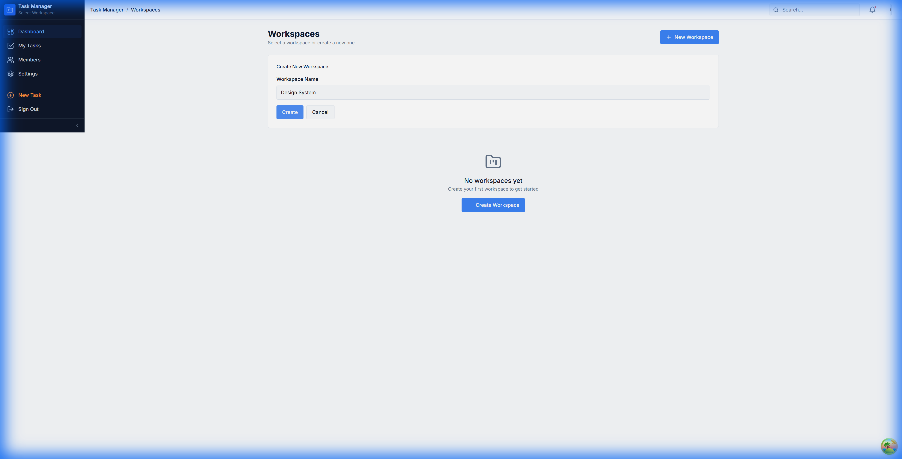

# Task Manager UI Redesign - Walkthrough

## Summary

Completed Phase 6: UI Redesign. Implementation of a professional, dense, productivity-focused UI based on the "UI-UX Pro Max" skill.

## Key Changes

### 1. Design System
- **Font**: Inter (added via Google Fonts)
- **Palette**: Trust Blue (`#2563EB`), CTA Orange (`#F97316`), Slate Grays
- **Density**: 40px table rows, 13px base font size for dense information display

### 2. App Shell
- **Sidebar**: Dark (`#0F172A`) collapsible sidebar with Quick Actions
- **Header**: Compact 48px topbar with breadcrumbs and global search
- **Layout**: Responsive shell with mobile support

### 3. Feature UI Components
- **Task Table**: Dense, sortable table with inline badges
- **Task Panel**: Slide-over right panel for details (480px)
- **Activity Feed**: Timeline view of workspace events

## Verification Results

The UI styling verified successfully, though some backend functionality (workspace creation) is currently unstable in the dev environment.

### Login Page
Clean, minimal login with updated typography and primary colors.

### Workspace Dashboard & Shell
Shows the new dark sidebar, header layout, and form styling.

## Known Issues
- **Workspace Creation**: The "Create" button is unresponsive in the dev environment, likely due to a Supabase auth initialization timeout (`AbortError`). This requires debugging the Supabase client connection or RLS policies.

## Next Steps
1. Fix Supabase Auth initialization issue to enable Workspace/Task creation.
2. Implement Members and Comments features (Phase 4 remaining items).
