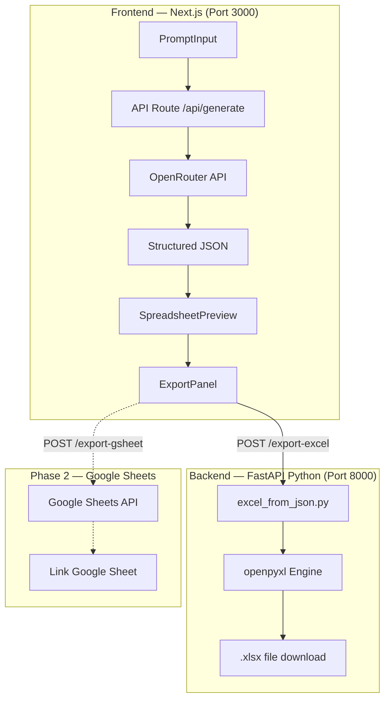
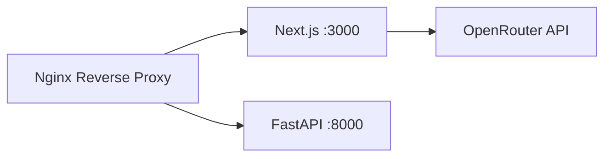

# AI Excel & Google Sheet Generator App — Updated Plan

Ứng dụng web cho phép người dùng tạo file **Excel (.xlsx)** và **Google Sheet** chuyên nghiệp bằng ngôn ngữ tự nhiên, thông qua AI (OpenRouter multi-model).

## Quyết định đã xác nhận

| Hạng mục | Quyết định |
|---|---|
| **AI Provider** | OpenRouter (chọn model: Claude ưu tiên, Gemini, OpenAI) |
| **Google Credentials** | Service Account `tdgames@gen-lang-client-0156221369.iam.gserviceaccount.com` |
| **Deployment** | VPS Ubuntu |
| **Phase 1** | MVP = Excel only |
| **Phase 2** | Google Sheets (triển khai sau) |

---

## Kiến trúc tổng quan



**Tại sao tách 2 service?**
- Next.js xử lý frontend + AI call (TypeScript)
- FastAPI xử lý Excel generation (Python/openpyxl) — dễ deploy riêng, dễ scale

---

## Proposed Changes — Phase 1 MVP

### Component 1: Python Engine (FastAPI)

#### [NEW] `engine/server.py`
FastAPI microservice chạy trên port 8000:
- `POST /export-excel` — nhận JSON → trả file .xlsx
- `GET /health` — health check
- CORS cho phép frontend gọi

#### [NEW] `engine/excel_from_json.py`
Converter chính: JSON schema → Excel file. Sử dụng `ExcelBuilder` class có sẵn từ `templates/excel_template.py` + mở rộng thêm:
- Parse JSON từ AI → auto-detect pattern (timeline, summary, job description, report)
- Apply theme colors
- Handle merge cells, group rows, freeze panes
- Multi-sheet support

#### [NEW] `engine/themes.py`
5 color themes có sẵn:

| Theme | Header | Group | Accent |
|---|---|---|---|
| `corporate_blue` | #4472C4 | #D9E2F3 | #70AD47 |
| `maroon` | #4A1A2E | #F2E6E9 | #8B3A4A |
| `teal` | #1A4A4A | #E6F2F2 | #2D6B6B |
| `dark_mode` | #2D2D2D | #404040 | #4FC3F7 |
| `forest_green` | #2E7D32 | #E8F5E9 | #66BB6A |

#### [MODIFY] [excel_template.py](file:///e:/TDC_App/TDGAMES_App/excel-professional-skill/templates/excel_template.py)
- Thêm `ExcelBuilder.from_json(json_data, theme)` class method
- Thêm theme parameter cho các styling methods

#### [NEW] `engine/requirements.txt`
```
fastapi==0.115.0
uvicorn==0.34.0
openpyxl==3.1.5
python-multipart==0.0.20
```

---

### Component 2: AI Integration (OpenRouter)

#### [NEW] `src/lib/aiProvider.ts`
OpenRouter client sử dụng OpenAI SDK (compatible):
```typescript
// OpenRouter dùng OpenAI-compatible API
const openai = new OpenAI({
  baseURL: "https://openrouter.ai/api/v1",
  apiKey: process.env.OPENROUTER_API_KEY,
});
```
- Hỗ trợ chọn model: `anthropic/claude-sonnet-4`, `google/gemini-2.5-pro`, `openai/gpt-4o`
- Streaming response support
- Error handling + retry

#### [NEW] `src/lib/prompts/system-prompt.ts`
System prompt hướng dẫn AI trả về JSON schema chuẩn:
- Định nghĩa JSON output format
- Danh sách patterns có sẵn
- Style guidelines (corporate colors, typography)
- Ngữ cảnh tiếng Việt (thuật ngữ doanh nghiệp VN)

#### [NEW] `src/app/api/generate/route.ts`
API route nhận prompt từ frontend → gọi OpenRouter → trả structured JSON. Sử dụng streaming để hiện progress.

---

### Component 3: Frontend (Next.js)

#### [MODIFY] `src/app/layout.tsx`
- Custom fonts (Inter from Google Fonts)
- Dark theme meta tags, favicon

#### [NEW] `src/app/globals.css`
Design system hoàn chỉnh:
- CSS variables cho colors, typography, spacing
- Dark glassmorphism theme
- Responsive breakpoints
- Animation keyframes

#### [MODIFY] `src/app/page.tsx`
Trang chính với layout 2 panel:
- **Left panel**: Chat input + prompt history
- **Right panel**: Spreadsheet preview + export buttons
- State management: prompt → AI response → preview → export

#### [NEW] `src/components/PromptInput.tsx`
- Textarea với auto-resize
- Template chips bar: "Bảng kế hoạch", "Báo cáo tài chính", "Timeline", "Mô tả CV"
- Loading state khi AI đang generate
- Hỗ trợ upload CSV/JSON để AI format lại

#### [NEW] `src/components/SpreadsheetPreview.tsx`
- Render JSON → HTML table với full styling (colors, borders, merge cells)
- Hiển thị sheet tabs nếu multi-sheet
- Responsive scroll

#### [NEW] `src/components/ExportPanel.tsx`
- Nút Download Excel (.xlsx) — gọi Python engine
- Nút Copy JSON (debug)
- Theme selector dropdown
- (Phase 2: nút Export to Google Sheet)

#### [NEW] `src/app/settings/page.tsx`
- Form nhập OpenRouter API key
- Model selector dropdown
- Lưu settings vào localStorage

---

### Component 4: Environment & Config

#### [NEW] `app/.env.local`
```env
OPENROUTER_API_KEY=your_openrouter_key_here
PYTHON_ENGINE_URL=http://localhost:8000
```

#### [NEW] `app/.env.example`
Template cho deployment (không chứa secrets).

---

## Cấu trúc thư mục cuối cùng

```
excel-professional-skill/
├── app/                          # Next.js frontend
│   ├── src/
│   │   ├── app/
│   │   │   ├── page.tsx          # Main page
│   │   │   ├── layout.tsx
│   │   │   ├── globals.css
│   │   │   ├── settings/page.tsx # Settings
│   │   │   └── api/
│   │   │       └── generate/route.ts
│   │   ├── components/
│   │   │   ├── PromptInput.tsx
│   │   │   ├── SpreadsheetPreview.tsx
│   │   │   └── ExportPanel.tsx
│   │   └── lib/
│   │       ├── aiProvider.ts
│   │       └── prompts/system-prompt.ts
│   ├── .env.local
│   ├── .env.example
│   ├── package.json
│   └── next.config.ts
├── engine/                       # Python FastAPI backend
│   ├── server.py
│   ├── excel_from_json.py
│   ├── themes.py
│   └── requirements.txt
├── templates/                    # Existing templates (reused)
│   ├── excel_template.py
│   └── timeline_template.py
├── GOOGLE_SERVICE_ACCOUNT_KEY.json  # (Phase 2)
└── SKILL.md
```

---

## Deployment (VPS Ubuntu)



- **Next.js**: `npm run build && npm start` (or PM2)
- **FastAPI**: `uvicorn server:app --host 0.0.0.0 --port 8000` (or systemd service)
- **Nginx**: Reverse proxy cả 2 service, SSL via Let's Encrypt

---

## Thứ tự triển khai (Phase 1)

| Step | Mô tả | Ước lượng |
|---|---|---|
| 1 | Python Engine: `themes.py` + `excel_from_json.py` + `server.py` | ★★★ |
| 2 | AI: `system-prompt.ts` + `aiProvider.ts` + `/api/generate` | ★★★ |
| 3 | Frontend: `globals.css` + layout + components | ★★★★ |
| 4 | Integration: connect all parts, E2E test | ★★ |

---

## Verification Plan

### Automated
- `python -m pytest engine/` — test JSON → Excel output
- `npm run build` — verify Next.js build

### Manual
1. Start cả 2 services (Next.js + FastAPI)
2. Nhập prompt: *"Tạo bảng kế hoạch Q2 gồm 3 nhóm: Marketing, Sales, Operations"*
3. Verify preview hiển thị đúng bảng
4. Download Excel → mở verify format đẹp
5. Thử đổi model (Claude → Gemini) → verify generate đúng
6. Thử đổi theme (maroon → teal) → verify colors
