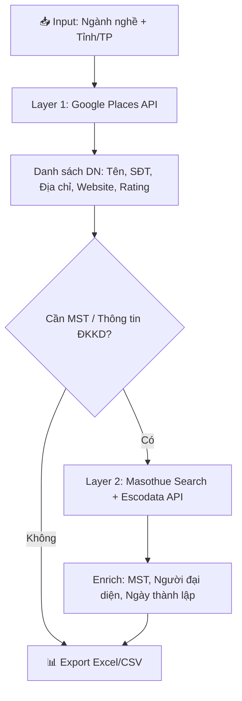

# Tìm Kiếm Doanh Nghiệp Việt Nam Theo Ngành Nghề & Tỉnh Thành

## Mục Tiêu

Xây dựng tool Python tự động tìm kiếm và thu thập thông tin sơ bộ các công ty thuộc **một ngành nghề** tại **một tỉnh/thành phố** ở Việt Nam.

- **Input**: Ngành nghề (VD: "xây dựng", "nhà hàng") + Tỉnh/Thành phố (VD: "Đà Nẵng", "Hà Nội")
- **Output**: Danh sách công ty với thông tin sơ bộ → xuất ra Excel/CSV

---

## Phân Tích Các Nguồn Dữ Liệu

### So sánh tổng quan

| Tiêu chí | Google Places API (New) | Masothue.com Scraping | dangkykinhdoanh.gov.vn |
|---|---|---|---|
| **Dữ liệu** | Tên, địa chỉ, SĐT, website, rating, giờ mở cửa | Tên, MST, đại diện pháp lý, địa chỉ | Tên, MST, ngành nghề, vốn |
| **Lọc ngành + tỉnh** | ✅ Tự nhiên qua text query | ❌ Chỉ lọc riêng ngành HOẶC tỉnh | ❌ Chỉ tra từng DN |
| **API chính thức** | ✅ Có | ❌ Không | ❌ Không có API công khai |
| **Free tier** | 10K req/tháng (Essentials) | Free nhưng có quảng cáo chặn | Free tra cứu đơn lẻ |
| **Tính pháp lý** | ✅ Hoàn toàn hợp pháp | ⚠️ Rủi ro vi phạm ToS | ⚠️ Không có API |
| **Độ tin cậy** | ⭐⭐⭐⭐⭐ | ⭐⭐ (dễ bị block) | ⭐⭐ |
| **Dữ liệu MST** | ❌ Không có | ✅ Có | ✅ Có |

### Chi tiết từng nguồn

#### 1. 🟢 Google Places API (New) — **KHUYẾN NGHỊ LÀM NGUỒN CHÍNH**

**Ưu điểm:**
- **Text Search** cho phép query tự nhiên: `"nhà hàng tại Đà Nẵng"` → trả về danh sách DN thực tế
- Dữ liệu phong phú: tên, địa chỉ, SĐT, website, rating, reviews, giờ hoạt động
- Free tier hào phóng: **10,000 requests/tháng** (Essentials), **5,000 requests/tháng** (Pro)
- Mỗi request trả ~20 kết quả, hỗ trợ pagination → **tối đa ~200K công ty/tháng miễn phí**
- API chính thức, ổn định, không lo bị block

**Nhược điểm:**
- Không có MST (mã số thuế) hay thông tin đăng ký kinh doanh
- Cần Google Cloud account + billing (dù chỉ dùng free tier)
- Kết quả thiên về DN đã đăng ký trên Google Maps (có thể thiếu DN nhỏ)

**Chi phí:** FREE cho nhu cầu thông thường. Vượt free tier: ~$32/1000 req (Essentials)

#### 2. 🟡 Masothue.com — **NGUỒN BỔ SUNG (Enrichment)**

**Cấu trúc URL đã xác nhận:**
```
Ngành nghề: https://masothue.com/tra-cuu-ma-so-thue-theo-nganh-nghe/{slug}-{id}
Tỉnh thành: https://masothue.com/tra-cuu-ma-so-thue-theo-tinh/{slug}-{id}
Pagination:  ?page=N
Tra cứu MST: https://masothue.com/{mst}
```

**Dữ liệu mỗi DN:** Tên công ty, MST, người đại diện, địa chỉ

**Rào cản kỹ thuật:**
- ⚠️ Modal quảng cáo chặn nội dung ("Xem thêm nội dung" - phải xem quảng cáo)
- ⚠️ Cloudflare protection
- ⚠️ Không hỗ trợ lọc đồng thời ngành + tỉnh
- ⚠️ ~20-30 DN/trang

**Kịch bản sử dụng:** Sau khi có danh sách tên DN từ Google Places → tra MST trên masothue → lấy thêm thông tin đăng ký

#### 3. 🟡 Escodata.net API — **NGUỒN BỔ SUNG (Tra MST)**

- API FREE: `GET https://escodata.net/api-mst/{MST}.htm` → JSON
- Chỉ tra cứu theo MST (không tìm theo ngành/tỉnh)
- Dùng để enrich dữ liệu sau khi đã có MST

---

## Phương Án Đề Xuất: Hybrid 2 Lớp

> [!IMPORTANT]
> **Phương án tối ưu nhất** là kết hợp Google Places API làm nguồn chính + masothue.com/escodata để bổ sung thông tin MST/đăng ký kinh doanh.

### Kiến trúc tổng quan



### Data Fields Output

| Field | Nguồn | Ghi chú |
|---|---|---|
| Tên công ty | Google Places | Primary |
| Địa chỉ | Google Places | Formatted address |
| Số điện thoại | Google Places | International format |
| Website | Google Places | Nếu có |
| Rating / Đánh giá | Google Places | 1-5 stars |
| Số lượng reviews | Google Places | Popularity indicator |
| Giờ hoạt động | Google Places | Nếu có |
| Google Maps URL | Google Places | Link trực tiếp |
| Mã số thuế (MST) | Masothue | Layer 2 - Optional |
| Người đại diện | Masothue / Escodata | Layer 2 - Optional |
| Ngày thành lập | Escodata | Layer 2 - Optional |
| Tình trạng hoạt động | Escodata | Layer 2 - Optional |

---

## User Review Required

> [!WARNING]
> **Google Cloud Account**: Bạn cần có Google Cloud account với billing enabled. API Key cho Places API (New) cần được tạo. Bạn đã có Google Cloud project `open-493116` (dùng cho GOG CLI). Có muốn dùng lại project này hay tạo project mới?

> [!IMPORTANT]
> **Chọn phạm vi Layer 2**: Layer 2 (tra MST via masothue/escodata) sẽ tăng thời gian chạy đáng kể do phải tra từng DN. Bạn muốn:
> - **(A)** Chỉ Layer 1 (Google Places) — nhanh, đủ cho mục đích tiếp cận kinh doanh
> - **(B)** Layer 1 + Layer 2 — đầy đủ nhưng chậm hơn, có rủi ro bị masothue block
> - **(C)** Layer 1 + Escodata only — cần có MST trước (hạn chế hơn nhưng ổn định)

---

## Proposed Changes

### Component: Company Search Tool

Workspace: `e:\TDC_App\TD_Consulting_App\Client_Search\`

#### [NEW] [config.py](file:///e:/TDC_App/TD_Consulting_App/Client_Search/config.py)
- Cấu hình API keys, rate limits, output paths
- Mapping ngành nghề → Google Places types
- Mapping tỉnh thành → coordinates/region codes

#### [NEW] [google_places_searcher.py](file:///e:/TDC_App/TD_Consulting_App/Client_Search/google_places_searcher.py)
- Class `GooglePlacesSearcher`:
  - `search_businesses(industry: str, province: str) -> list[dict]`
  - Text Search (New) API integration
  - Auto-pagination qua `nextPageToken`
  - Field mask optimization để tiết kiệm chi phí
  - Rate limiting & retry logic

#### [NEW] [masothue_enricher.py](file:///e:/TDC_App/TD_Consulting_App/Client_Search/masothue_enricher.py)
- Class `MasothueEnricher` (Layer 2 - Optional):
  - Tìm MST từ tên công ty qua masothue.com search
  - Lấy thông tin chi tiết qua escodata API
  - Anti-detection: random delays, user-agent rotation
  - Graceful degradation nếu bị block

#### [NEW] [exporter.py](file:///e:/TDC_App/TD_Consulting_App/Client_Search/exporter.py)
- Export kết quả ra Excel (.xlsx) với formatting đẹp
- Export CSV backup
- Deduplication logic

#### [NEW] [main.py](file:///e:/TDC_App/TD_Consulting_App/Client_Search/main.py)
- CLI interface: `python main.py --industry "xây dựng" --province "Đà Nẵng"`
- Orchestrator kết hợp các layers
- Progress bar & logging
- Resume capability nếu bị gián đoạn

#### [NEW] [.env](file:///e:/TDC_App/TD_Consulting_App/Client_Search/.env)
- `GOOGLE_PLACES_API_KEY=...`
- `ENABLE_LAYER2=true/false`

#### [NEW] [requirements.txt](file:///e:/TDC_App/TD_Consulting_App/Client_Search/requirements.txt)
- `requests`, `openpyxl`, `python-dotenv`, `tqdm`, `tenacity`

---

## Ước Tính Chi Phí & Hiệu Suất

| Kịch bản | Chi phí | Thời gian | Số DN tối đa |
|---|---|---|---|
| Layer 1 only, 1 query | FREE | ~5 giây | ~60 DN (3 pages) |
| Layer 1 only, 10 queries | FREE | ~1 phút | ~600 DN |
| Layer 1 + Layer 2, 1 query | FREE | ~5-10 phút | ~60 DN + enriched |
| Layer 1, full month | FREE | - | ~200K DN |

---

## Open Questions

1. **Google Cloud Project**: Dùng lại project `open-493116` hay tạo mới?
2. **Layer 2 scope**: Chọn phương án A, B, hay C (xem phần User Review)?
3. **Use case cụ thể**: Tool này phục vụ mục đích gì? (Lead generation cho TD Consulting? Nghiên cứu thị trường?) — để tối ưu output format
4. **Ngành nghề mẫu**: Có ngành nghề + tỉnh thành cụ thể nào muốn test trước không?

---

## Verification Plan

### Automated Tests
1. Chạy test với query mẫu: `"nhà hàng tại Đà Nẵng"` → verify output có dữ liệu hợp lệ
2. Verify Excel output mở được và format đúng
3. Test pagination: query trả >20 kết quả → verify lấy đủ pages
4. Test error handling: invalid API key, network timeout

### Manual Verification
1. Cross-check 5-10 DN trong kết quả với Google Maps trực tiếp
2. Verify MST data (nếu dùng Layer 2) với masothue.com thủ công
3. Kiểm tra deduplication hoạt động đúng
