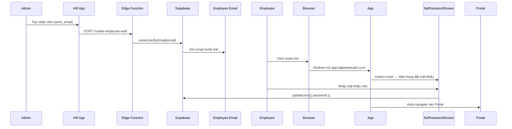

# Employee Invite Flow — Walkthrough

## Tóm tắt thay đổi

### 1. Edge Function `create-employee-auth` (v2)
- Thay `createUser(password)` → `inviteUserByEmail(email, { redirectTo })`
- Supabase tự động gửi email invite tới nhân viên
- `redirectTo` = `https://app.tdgamestudio.com`
- Nếu email đã tồn tại → chỉ update metadata, không lỗi

### 2. `SetPasswordScreen.tsx` (NEW)
- Giao diện đặt mật khẩu mới (theme xanh để phân biệt với login)
- Có validate: min 6 ký tự, xác nhận khớp
- Gọi `supabase.auth.updateUser({ password })` để set password

### 3. `App.tsx`
- Detect invite token via `onAuthStateChange` event (`SIGNED_IN` + `type=invite` in URL hash)
- Hiện `SetPasswordScreen` thay vì redirect về login/home
- Sau khi set password → member role tự động vào Portal

### 4. `hrService.ts`
- Update response handling: log invite status thay vì temp password

## Luồng hoàn chỉnh

## ⚠️ Cấu hình cần thiết trên Supabase Dashboard

> [!IMPORTANT]
> Bạn cần vào **Supabase Dashboard** → **Authentication** → **URL Configuration** và cấu hình:
> 1. **Site URL**: `https://app.tdgamestudio.com`
> 2. **Redirect URLs**: Thêm `https://app.tdgamestudio.com`
> 
> Nếu không cấu hình, link trong email invite sẽ redirect sai URL.
