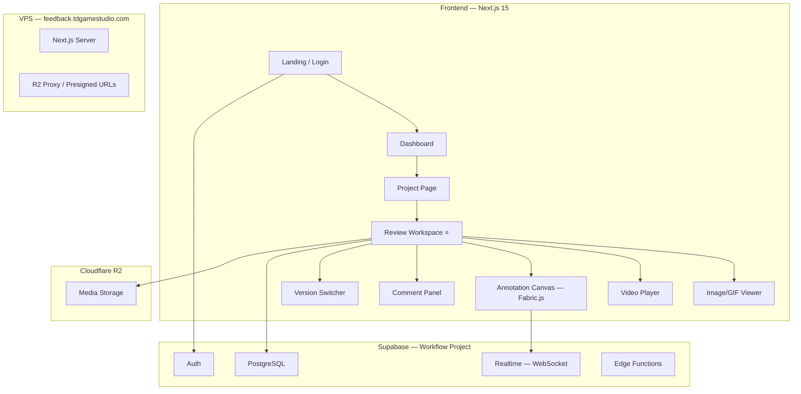

# TD_Feedback — Visual Review & Feedback Platform

## Confirmed Details

| Item | Decision |
|------|----------|
| **App Name** | TD_Feedback |
| **Supabase Project** | `Workflow` (`fifuhkupaqcfjwyouwpa`, ap-northeast-1) |
| **Storage** | Cloudflare R2 |
| **Scope** | Phase 1 (MVP) first |
| **Media Types** | Image, GIF, Video (2D focused) |
| **Domain** | `feedback.tdgamestudio.com` |
| **Hosting** | VPS |

---

## Architecture



## Tech Stack

| Layer | Tech |
|-------|------|
| Frontend | Next.js 15, App Router, TypeScript |
| Styling | Vanilla CSS + CSS Modules, dark theme |
| Annotation | Fabric.js |
| Video Player | Custom HTML5 Video + Canvas overlay |
| State | Zustand |
| Auth & DB | Supabase (project `Workflow`) |
| Storage | Cloudflare R2 (presigned URLs) |
| Realtime | Supabase Realtime |
| Deploy | VPS, `feedback.tdgamestudio.com` |

---

## Database Schema (Supabase — `public` schema)

```sql
-- fb_projects: Nhóm review items theo dự án khách hàng
CREATE TABLE fb_projects (
  id UUID PRIMARY KEY DEFAULT gen_random_uuid(),
  name TEXT NOT NULL,
  description TEXT,
  thumbnail_url TEXT,
  owner_id UUID REFERENCES auth.users(id),
  status TEXT DEFAULT 'active',
  created_at TIMESTAMPTZ DEFAULT now(),
  updated_at TIMESTAMPTZ DEFAULT now()
);

-- fb_review_items: Từng file cần review
CREATE TABLE fb_review_items (
  id UUID PRIMARY KEY DEFAULT gen_random_uuid(),
  project_id UUID REFERENCES fb_projects(id) ON DELETE CASCADE,
  name TEXT NOT NULL,
  media_type TEXT NOT NULL, -- 'image', 'gif', 'video'
  media_url TEXT NOT NULL,
  thumbnail_url TEXT,
  duration_ms INTEGER,
  fps REAL DEFAULT 24,
  width INTEGER,
  height INTEGER,
  file_size BIGINT,
  sort_order INTEGER DEFAULT 0,
  version INTEGER DEFAULT 1,
  parent_item_id UUID REFERENCES fb_review_items(id),
  uploaded_by UUID REFERENCES auth.users(id),
  status TEXT DEFAULT 'pending_review',
  created_at TIMESTAMPTZ DEFAULT now(),
  updated_at TIMESTAMPTZ DEFAULT now()
);

-- fb_annotations: Drawings trên frame cụ thể
CREATE TABLE fb_annotations (
  id UUID PRIMARY KEY DEFAULT gen_random_uuid(),
  review_item_id UUID REFERENCES fb_review_items(id) ON DELETE CASCADE,
  frame_number INTEGER,
  timestamp_ms INTEGER,
  annotation_data JSONB NOT NULL,
  color TEXT DEFAULT '#FF0000',
  author_id UUID REFERENCES auth.users(id),
  created_at TIMESTAMPTZ DEFAULT now()
);

-- fb_comments: Text feedback
CREATE TABLE fb_comments (
  id UUID PRIMARY KEY DEFAULT gen_random_uuid(),
  review_item_id UUID REFERENCES fb_review_items(id) ON DELETE CASCADE,
  annotation_id UUID REFERENCES fb_annotations(id),
  parent_comment_id UUID REFERENCES fb_comments(id),
  content TEXT NOT NULL,
  frame_number INTEGER,
  timestamp_ms INTEGER,
  author_id UUID REFERENCES auth.users(id),
  is_resolved BOOLEAN DEFAULT false,
  resolved_by UUID REFERENCES auth.users(id),
  created_at TIMESTAMPTZ DEFAULT now(),
  updated_at TIMESTAMPTZ DEFAULT now()
);

-- fb_share_links: Chia sẻ review cho external clients
CREATE TABLE fb_share_links (
  id UUID PRIMARY KEY DEFAULT gen_random_uuid(),
  project_id UUID REFERENCES fb_projects(id) ON DELETE CASCADE,
  review_item_id UUID REFERENCES fb_review_items(id),
  token TEXT UNIQUE NOT NULL,
  permissions TEXT DEFAULT 'view_comment',
  expires_at TIMESTAMPTZ,
  password_hash TEXT,
  created_by UUID REFERENCES auth.users(id),
  created_at TIMESTAMPTZ DEFAULT now()
);
```

> [!NOTE]
> Tables prefixed with `fb_` to avoid conflicts with existing tables in the `Workflow` project.

---

## Phase 1 MVP — Component Breakdown

### Project Structure
```
e:\TDC_App\TDGAMES_App\SyncSketch\
├── src/
│   ├── app/
│   │   ├── page.tsx                    # Landing
│   │   ├── layout.tsx                  # Root layout
│   │   ├── globals.css                 # Design system
│   │   ├── (auth)/login/page.tsx
│   │   ├── (auth)/signup/page.tsx
│   │   ├── dashboard/page.tsx
│   │   ├── project/[id]/page.tsx
│   │   ├── review/[id]/page.tsx        # ⭐ Core
│   │   ├── shared/[token]/page.tsx     # Public review
│   │   └── api/
│   │       ├── upload/route.ts         # R2 presigned URL
│   │       └── share/route.ts
│   ├── components/
│   │   ├── canvas/                     # AnnotationCanvas, DrawingToolbar
│   │   ├── player/                     # VideoPlayer, ImageViewer
│   │   ├── comments/                   # CommentPanel, CommentForm
│   │   ├── timeline/                   # AnnotationTimeline
│   │   ├── upload/                     # MediaUploader
│   │   ├── version/                    # VersionSwitcher
│   │   ├── share/                      # ShareDialog
│   │   └── layout/                     # Sidebar, Header
│   ├── lib/
│   │   ├── supabase.ts                 # Client init
│   │   ├── r2.ts                       # R2 upload helpers
│   │   └── utils.ts
│   ├── hooks/
│   ├── stores/
│   └── types/
├── public/
├── next.config.ts
├── package.json
└── .env.local
```

### Key Features (Phase 1)

1. **Upload**: Drag & drop Image/GIF/Video → R2 → auto thumbnail
2. **Annotation**: Brush, shapes, arrows, text — frame-accurate cho video
3. **Comments**: Frame-specific, threaded, resolve/unresolve
4. **Video Player**: Frame-by-frame (←→), loop, speed, timecode
5. **Versions**: Upload new version, A/B side-by-side compare
6. **Share Links**: Public link (no login), optional password

### Design — Dark Theme

| Token | Value | Usage |
|-------|-------|-------|
| `--bg-primary` | `#0D0D0F` | Main bg |
| `--bg-secondary` | `#16161A` | Panels |
| `--bg-tertiary` | `#1E1E24` | Inputs |
| `--accent` | `#6C5CE7` | Primary |
| `--accent-blue` | `#00D2FF` | Active |
| `--success` | `#00E676` | Approved |
| `--warning` | `#FFB300` | Revision |
| `--danger` | `#FF5252` | Urgent |
| `--text-primary` | `#F5F5F7` | Text |
| `--text-muted` | `#8E8E93` | Muted |

---

## Verification Plan

1. Upload image → annotate → save → reload → verify annotation persists
2. Upload video → navigate to frame 50 → draw → go to frame 100 → back to 50 → verify
3. Add comment at frame → verify timeline marker
4. Upload version 2 → compare with v1
5. Generate share link → open incognito → verify access
6. Test responsive on desktop browsers

---

## User Questions

> [!IMPORTANT]
> **Cloudflare R2**: Anh đã có R2 bucket chưa? Cần access key + secret key + bucket name + account ID để config. Nếu chưa có, tôi có thể guide setup.
