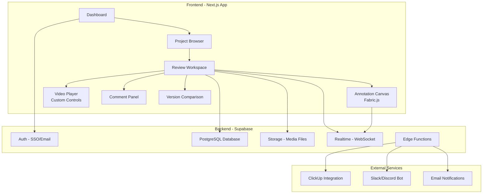

# TD Games SyncSketch - Visual Review & Feedback Platform

## Mục tiêu

Xây dựng một nền tảng review/feedback trực quan cho **TD Games Studio** (chuyên Outsource Art/Animation/VFX), lấy cảm hứng từ SyncSketch. App tập trung vào việc feedback Art, Animation và VFX một cách hiệu quả, dễ dàng cho cả Internal team và External clients.

---

## User Review Required

> [!IMPORTANT]
> **Quyết định về Tech Stack & Hosting**: Plan đề xuất dùng **Next.js + Supabase** (tận dụng Supabase project đã có). Nếu muốn dùng stack khác (VPS riêng, Firebase, v.v.), cần confirm trước khi bắt đầu.

> [!IMPORTANT]
> **Phạm vi MVP**: Plan chia thành 4 phases. Cần confirm có muốn build tất cả hay chỉ tập trung Phase 1 (Core) trước.

> [!WARNING]
> **Storage & Chi phí**: Upload video/image sẽ cần storage đáng kể. Cần xác nhận sử dụng Supabase Storage (có giới hạn theo plan) hay S3/Cloudflare R2 cho media files.

> [!IMPORTANT]
> **Domain & Branding**: Cần confirm tên app chính thức (ví dụ: "TD Review", "ArtSync", "TD Sketch"...) và domain nếu có.

---

## Tổng quan Kiến trúc



---

## Tech Stack

| Layer | Technology | Lý do |
|-------|-----------|------|
| **Frontend** | Next.js 15 (App Router) | SSR, performance, routing |
| **UI Framework** | Vanilla CSS + CSS Modules | Full control, premium design |
| **Canvas/Annotation** | Fabric.js | Powerful drawing, shapes, text on canvas |
| **Video Player** | Custom HTML5 Video + Canvas overlay | Frame-accurate annotation |
| **State Management** | Zustand | Lightweight, simple |
| **Backend** | Supabase (project `Web_App` hoặc tạo mới) | Auth, DB, Storage, Realtime |
| **Database** | PostgreSQL (Supabase) | Relational, robust |
| **Storage** | Supabase Storage / Cloudflare R2 | Media files |
| **Realtime** | Supabase Realtime (WebSocket) | Live collaboration |
| **Deployment** | Vercel | Tích hợp tốt với Next.js |

---

## Proposed Changes - Phased Development

---

### 🔷 Phase 1: Core Platform (MVP) — _~3-4 weeks_

Xây dựng nền tảng cơ bản: upload, xem, annotate, và comment.

#### Database Schema

```sql
-- Projects: Nhóm các review items theo dự án
CREATE TABLE projects (
  id UUID PRIMARY KEY DEFAULT gen_random_uuid(),
  name TEXT NOT NULL,
  description TEXT,
  thumbnail_url TEXT,
  owner_id UUID REFERENCES auth.users(id),
  team_id UUID,
  status TEXT DEFAULT 'active', -- active, archived
  created_at TIMESTAMPTZ DEFAULT now(),
  updated_at TIMESTAMPTZ DEFAULT now()
);

-- Review Items: Từng file cần review (image/video/3D)
CREATE TABLE review_items (
  id UUID PRIMARY KEY DEFAULT gen_random_uuid(),
  project_id UUID REFERENCES projects(id) ON DELETE CASCADE,
  name TEXT NOT NULL,
  media_type TEXT NOT NULL, -- image, video, sequence
  media_url TEXT NOT NULL,
  thumbnail_url TEXT,
  duration_ms INTEGER, -- for video
  frame_count INTEGER, -- for image sequence
  fps REAL DEFAULT 24,
  width INTEGER,
  height INTEGER,
  file_size BIGINT,
  sort_order INTEGER DEFAULT 0,
  version INTEGER DEFAULT 1,
  parent_item_id UUID REFERENCES review_items(id), -- version chain
  uploaded_by UUID REFERENCES auth.users(id),
  status TEXT DEFAULT 'pending_review', -- pending_review, in_review, approved, revision_needed
  created_at TIMESTAMPTZ DEFAULT now(),
  updated_at TIMESTAMPTZ DEFAULT now()
);

-- Annotations: Drawings/marks trên frame cụ thể
CREATE TABLE annotations (
  id UUID PRIMARY KEY DEFAULT gen_random_uuid(),
  review_item_id UUID REFERENCES review_items(id) ON DELETE CASCADE,
  frame_number INTEGER, -- frame tại thời điểm annotate
  timestamp_ms INTEGER, -- timestamp cho video
  annotation_data JSONB NOT NULL, -- Fabric.js canvas JSON
  color TEXT DEFAULT '#FF0000',
  author_id UUID REFERENCES auth.users(id),
  created_at TIMESTAMPTZ DEFAULT now()
);

-- Comments: Text feedback gắn với annotation hoặc timeline
CREATE TABLE comments (
  id UUID PRIMARY KEY DEFAULT gen_random_uuid(),
  review_item_id UUID REFERENCES review_items(id) ON DELETE CASCADE,
  annotation_id UUID REFERENCES annotations(id),
  parent_comment_id UUID REFERENCES comments(id), -- reply thread
  content TEXT NOT NULL,
  frame_number INTEGER,
  timestamp_ms INTEGER,
  author_id UUID REFERENCES auth.users(id),
  is_resolved BOOLEAN DEFAULT false,
  resolved_by UUID REFERENCES auth.users(id),
  created_at TIMESTAMPTZ DEFAULT now(),
  updated_at TIMESTAMPTZ DEFAULT now()
);

-- Teams & Members
CREATE TABLE teams (
  id UUID PRIMARY KEY DEFAULT gen_random_uuid(),
  name TEXT NOT NULL,
  slug TEXT UNIQUE NOT NULL,
  owner_id UUID REFERENCES auth.users(id),
  created_at TIMESTAMPTZ DEFAULT now()
);

CREATE TABLE team_members (
  team_id UUID REFERENCES teams(id) ON DELETE CASCADE,
  user_id UUID REFERENCES auth.users(id) ON DELETE CASCADE,
  role TEXT DEFAULT 'reviewer', -- admin, artist, reviewer, client
  PRIMARY KEY (team_id, user_id)
);

-- Share Links: Chia sẻ review cho external clients
CREATE TABLE share_links (
  id UUID PRIMARY KEY DEFAULT gen_random_uuid(),
  project_id UUID REFERENCES projects(id) ON DELETE CASCADE,
  review_item_id UUID REFERENCES review_items(id),
  token TEXT UNIQUE NOT NULL,
  permissions TEXT DEFAULT 'view_comment', -- view_only, view_comment, full
  expires_at TIMESTAMPTZ,
  password_hash TEXT,
  created_by UUID REFERENCES auth.users(id),
  created_at TIMESTAMPTZ DEFAULT now()
);
```

#### Frontend Pages & Components

##### [NEW] `e:\TDC_App\TDGAMES_App\SyncSketch\` — Next.js Project Root

| Path | Mô tả |
|------|-------|
| `app/page.tsx` | Landing page |
| `app/(auth)/login/page.tsx` | Login (Supabase Auth) |
| `app/(auth)/signup/page.tsx` | Signup |
| `app/dashboard/page.tsx` | Dashboard - danh sách projects |
| `app/project/[id]/page.tsx` | Project view - grid/list review items |
| `app/review/[id]/page.tsx` | **⭐ Review Workspace** - core page |
| `components/canvas/AnnotationCanvas.tsx` | Fabric.js annotation overlay |
| `components/canvas/DrawingToolbar.tsx` | Brush, shapes, text, color picker |
| `components/player/VideoPlayer.tsx` | Custom video player với frame controls |
| `components/player/ImageViewer.tsx` | Zoomable image viewer |
| `components/player/SequencePlayer.tsx` | Image sequence playback |
| `components/comments/CommentPanel.tsx` | Sidebar comment list + thread |
| `components/comments/CommentForm.tsx` | Add comment form |
| `components/timeline/AnnotationTimeline.tsx` | Visual timeline với annotation markers |
| `components/upload/MediaUploader.tsx` | Drag & drop upload |
| `components/version/VersionSwitcher.tsx` | So sánh versions |
| `components/share/ShareDialog.tsx` | Tạo share links |
| `components/layout/Sidebar.tsx` | Navigation sidebar |
| `components/layout/Header.tsx` | Top bar with user menu |

#### Key Features - Phase 1

1. **Media Upload & Management**
   - Drag & drop upload images, videos, image sequences
   - Auto-generate thumbnails
   - Organize by projects

2. **Annotation System** (Core differentiator)
   - Freehand brush drawing with pressure sensitivity
   - Shapes: rectangle, circle, arrow, line
   - Text annotations
   - Color picker with preset colors
   - Frame-accurate annotations (tied to specific video frame)
   - Annotation history (undo/redo)

3. **Comment System**
   - Frame-specific comments (click on timeline → comment appears at that frame)
   - Threaded replies
   - @mention team members
   - Mark as resolved
   - Comment markers on timeline

4. **Video Player**
   - Frame-by-frame navigation (← → keys)
   - Loop range selection
   - Playback speed control
   - Frame counter display
   - Timecode display

5. **Version Control**
   - Upload new versions of same asset
   - Side-by-side comparison (A/B)
   - Onion skin overlay

6. **Share & Permissions**
   - Share via link (no login required for external clients)
   - Password-protected links
   - View-only / View+Comment permissions

---

### 🔷 Phase 2: Real-time Collaboration — _~2 weeks_

7. **Synchronized Review Session**
   - "Present Mode" — leader controls playback, everyone sees same frame
   - Real-time cursor visibility (see where others are looking)
   - Live annotation broadcast (draw → everyone sees immediately)
   - Session chat

8. **Notifications**
   - Email notifications for new comments/reviews
   - In-app notification center
   - Slack/Discord webhook notifications

---

### 🔷 Phase 3: Advanced Review Features — _~2-3 weeks_

9. **Comparison Tools**
   - Side-by-side version comparison
   - Overlay diff (blend modes)
   - Before/After slider
   - Animated GIF comparison

10. **Review Status Workflow**
    - Custom statuses: Pending → In Review → Needs Revision → Approved
    - Approval workflow (require N approvals)
    - Status dashboard / progress tracking

11. **Batch Operations**
    - Multi-select items → bulk status change
    - Batch download
    - Playlist mode (auto-play sequence of items)

---

### 🔷 Phase 4: Integrations & Advanced — _~2-3 weeks_

12. **ClickUp Integration**
    - Tự động tạo task khi item cần revision
    - Sync status giữa ClickUp ↔ Review app
    - Link review items trong ClickUp comments

13. **Slack/Discord Integration**
    - Post review updates to channels
    - Reply to comments from Slack/Discord

14. **NocoDB Integration**
    - Log review activities
    - Track project metrics
    - Reporting dashboard

---

## Cấu trúc Project

```
e:\TDC_App\TDGAMES_App\SyncSketch\
├── app/                          # Next.js App Router
│   ├── (auth)/                   # Auth pages
│   │   ├── login/page.tsx
│   │   └── signup/page.tsx
│   ├── dashboard/page.tsx        # Projects dashboard
│   ├── project/[id]/page.tsx     # Single project view
│   ├── review/[id]/page.tsx      # ⭐ Review workspace
│   ├── shared/[token]/page.tsx   # Public shared review
│   ├── layout.tsx                # Root layout
│   ├── page.tsx                  # Landing page
│   └── globals.css               # Global styles
├── components/
│   ├── canvas/                   # Annotation engine
│   ├── player/                   # Media players
│   ├── comments/                 # Comment system
│   ├── timeline/                 # Timeline & markers
│   ├── upload/                   # File upload
│   ├── version/                  # Version management
│   ├── share/                    # Sharing
│   ├── layout/                   # App shell
│   └── ui/                       # Common UI components
├── lib/
│   ├── supabase/                 # Supabase client & helpers
│   ├── annotation/               # Annotation logic
│   ├── media/                    # Media processing utils
│   └── utils/                    # General utilities
├── hooks/                        # Custom React hooks
├── stores/                       # Zustand stores
├── styles/                       # CSS modules
├── types/                        # TypeScript types
├── public/                       # Static assets
├── next.config.ts
├── package.json
└── tsconfig.json
```

---

## Design System

### Color Palette (Dark Theme — phù hợp review visual content)

| Token | Value | Usage |
|-------|-------|-------|
| `--bg-primary` | `#0D0D0F` | Main background |
| `--bg-secondary` | `#16161A` | Cards, panels |
| `--bg-tertiary` | `#1E1E24` | Inputs, hover states |
| `--accent-primary` | `#6C5CE7` | Primary buttons, links |
| `--accent-secondary` | `#00D2FF` | Active states |
| `--accent-success` | `#00E676` | Approved status |
| `--accent-warning` | `#FFB300` | Needs revision |
| `--accent-danger` | `#FF5252` | Rejected, urgent |
| `--text-primary` | `#F5F5F7` | Main text |
| `--text-secondary` | `#8E8E93` | Muted text |
| `--border` | `#2C2C30` | Borders |

### Typography
- **Font**: `Inter` (headings) + `JetBrains Mono` (timecode/frame numbers)
- Full dark mode optimized for viewing visual content

---

## Verification Plan

### Phase 1 Verification

#### Automated Tests
Sẽ setup sau khi có codebase:
```bash
# Unit tests cho annotation logic
npm run test -- --filter annotation

# Component tests
npm run test -- --filter components
```

#### Manual Verification (cần user test)
1. **Upload Flow**: Upload 1 image + 1 video → verify hiển thị đúng
2. **Annotation**: Vẽ annotation trên image → save → reload → verify vẫn còn
3. **Video Frame Annotation**: Vẽ annotation tại frame 50 → navigate đi chỗ khác → quay lại frame 50 → verify annotation hiển thị
4. **Comments**: Thêm comment tại frame → verify marker xuất hiện trên timeline
5. **Version Upload**: Upload version 2 → verify có thể switch giữa v1 và v2
6. **Share Link**: Tạo share link → mở incognito → verify xem và comment được
7. **Browser Testing**: Test trên Chrome, Firefox, Safari

#### Test bằng Browser Tool
- Navigate qua các pages: Dashboard → Project → Review
- Verify responsive design
- Test annotation drawing via canvas interactions
- Kiểm tra video player controls

---

## Câu hỏi cần Confirm trước khi bắt đầu

1. **Tên app chính thức?** (ví dụ: "TD Review", "ArtSync", "TD Sketch")
2. **Dùng Supabase project nào?** Tạo mới hay dùng `Web_App` hiện có?
3. **Storage choice?** Supabase Storage vs Cloudflare R2 vs AWS S3?
4. **Bắt đầu từ Phase nào?** Gợi ý: Phase 1 (MVP) trước
5. **Có cần hỗ trợ 3D model review** (như SyncSketch) hay chỉ cần Image + Video + Image Sequence?
6. **Domain/hosting** cho production?
