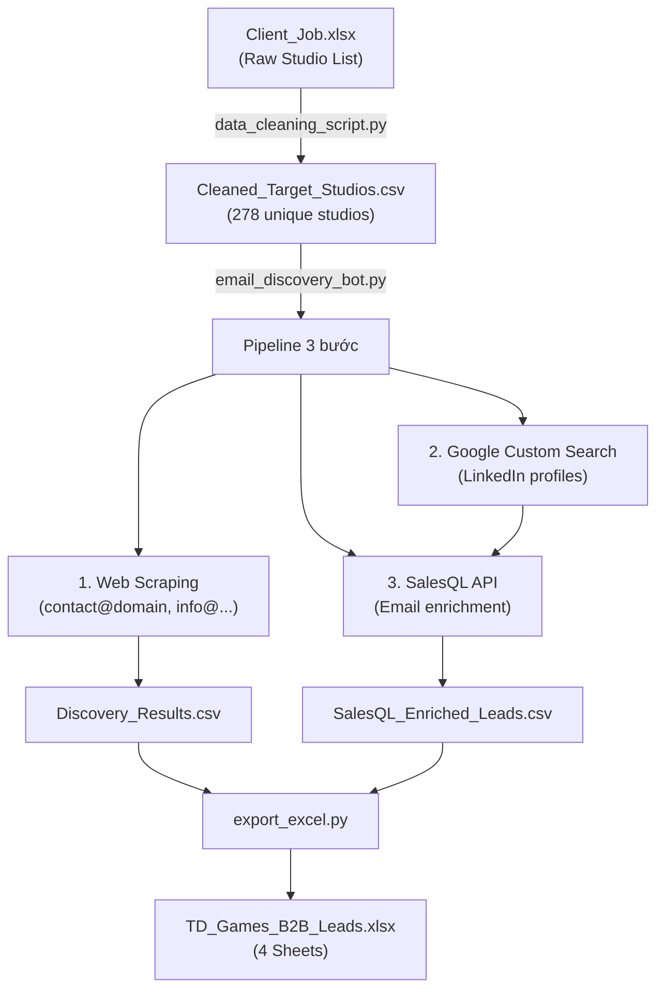

# TD Games — B2B Lead Discovery Pipeline

> **Mục đích**: Tự động tìm kiếm, enrichment và xác thực contacts phù hợp nhất từ 278+ Game Studios để thực hiện cold outreach cho dịch vụ Outsource Art/Animation/VFX.

---

## Architecture Overview



---

## File Structure

```
e:\TDC_App\TDGAMES_App\Client_Data\
├── .env                          # API Keys (SalesQL, Google CSE)
├── Client_Job.xlsx               # Input: Raw studio list (9 sheets)
├── data_cleaning_script.py       # Step 0: Clean & deduplicate studios
├── Cleaned_Target_Studios.csv    # Output Step 0: 278 unique studios
├── email_discovery_bot.py        # Step 1-3: Main pipeline
├── export_excel.py               # Step 4: Excel report generator
└── output/
    ├── Discovery_Results.csv          # All studios with emails found
    ├── SalesQL_Enriched_Leads.csv     # Enriched personal contacts
    └── TD_Games_B2B_Leads.xlsx        # Final professional report
```

---

## Pipeline Scripts

### 1. `data_cleaning_script.py`
- **Input**: `Client_Job.xlsx` (9 sheets with studio names + career page links)
- **Logic**: Dynamic header row detection → extract Studio + Domain → deduplicate (prioritize studio websites over ATS domains like greenhouse.io, lever.co)
- **Output**: `Cleaned_Target_Studios.csv` (278 unique studios)

### 2. `email_discovery_bot.py` — Core Pipeline
- **Batch processing**: 20 studios per batch, auto-stop after each batch for review
- **Resume capability**: Reads existing CSV output, skips already-processed studios
- **Real-time persistence**: Each studio saved immediately to CSV after processing

#### Step 1: Web Scraping
- Scrapes company website → extracts public emails (contact@, info@, press@)
- Falls back gracefully on errors

#### Step 2: Domain Email Discovery (Google + SMTP)
- Google searches `"@domain" contact OR info OR support`
- Extracts emails, verifies via SMTP/MX record lookup
- Returns `[valid]` / `[invalid]` / `[unknown]` status

#### Step 3: LinkedIn Search (Tier-Prioritized)
- Google search: `site:linkedin.com/in "Studio" ("Art Director" OR "Outsource Manager"...)`
- **Tier 1 search first**, Tier 2 fallback if < 3 results

#### Step 4: SalesQL Enrichment
- Enriches each LinkedIn URL → returns name, title, work email, personal email, phone
- **Work emails sorted first**, personal emails second
- Contacts with only phone (no email) → **skipped**
- Max 5 profiles per studio

#### 3-Tier Contact Prioritization System

| Tier | Score | Titles | Response Rate |
|------|-------|--------|---------------|
| ⭐ **Tier 1** | Highest | Art Director, Outsource Manager, Animation Director, VFX Supervisor, Head of Art | Quyết định trực tiếp |
| ★ **Tier 2** | Medium | Producer, Senior Producer, Lead Artist, Art Lead, Production Manager | Ảnh hưởng lớn |
| ☆ **Tier 3** | Lower | Creative Director, CEO, Founder, Marketing Manager | Forward thông tin |

### 3. `export_excel.py` — Excel Report
- **Sheet 1: Dashboard** — Stats overview (total studios, contacts by tier, work emails)
- **Sheet 2: Enriched Leads** — Full contact list with **separate Work Email / Personal Email columns**
- **Sheet 3: By Studio** — Studio-level summary with domain emails
- **Sheet 4: Campaign Ready** — Sorted by Tier + Work email availability → ready for cold email

---

## API Configuration (`.env`)

```env
# SalesQL API — https://app.salesql.com → Settings → API Access
SALESQL_API_KEY=<your_key>

# Google Custom Search API
# Step 1: https://console.cloud.google.com/apis/credentials → Enable "Custom Search API"
# Step 2: https://programmablesearchengine.google.com/ → "Search entire web" → Copy CX ID
GOOGLE_API_KEY=<your_key>
GOOGLE_CX_ID=<your_cx_id>

# Runtime settings
TEST_MODE=false
GOOGLE_DELAY=3     # seconds between Google API calls
SALESQL_DELAY=1     # seconds between SalesQL API calls
BATCH_SIZE=20       # studios per batch (configured in script)
```

---

## Dependencies

```bash
pip install pandas requests beautifulsoup4 python-dotenv openpyxl dnspython googlesearch-python
```

| Package | Purpose |
|---------|---------|
| `pandas` | CSV/DataFrame handling |
| `requests` | HTTP requests (scraping, API calls) |
| `beautifulsoup4` | HTML parsing for email extraction |
| `python-dotenv` | Load `.env` configuration |
| `openpyxl` | Excel file generation |
| `dnspython` | SMTP/MX record verification |
| `googlesearch-python` | Free Google search fallback |

---

## CSV Output Schema

### `Discovery_Results.csv`
| Column | Description |
|--------|-------------|
| Studio | Company name |
| Domain | Website domain |
| Original_Link | Career page URL |
| Scraped_Emails | Emails from web scraping |
| Verified_Domain_Emails | Domain emails verified via SMTP |
| LinkedIn_Targets | LinkedIn profile URLs found |
| SalesQL_Contact_Name | All contacts (pipe-separated) |
| SalesQL_Emails | All emails with tags (pipe-separated) |
| SalesQL_Phones | Phone numbers |

### `SalesQL_Enriched_Leads.csv`
| Column | Description |
|--------|-------------|
| Studio | Company name |
| Domain | Website domain |
| Contact_Name | Full name |
| Job_Title | LinkedIn job title |
| Tier | ⭐ Tier 1 / ★ Tier 2 / ☆ Tier 3 / Unranked |
| Company | Current employer |
| LinkedIn | Profile URL |
| **Work_Email** | Company email addresses (pipe-separated) |
| **Personal_Email** | Personal email addresses (pipe-separated) |
| Phones | Phone numbers |
| Location | Geographic location |

---

## Usage

```bash
# Step 0: Clean input data
python data_cleaning_script.py

# Step 1-3: Run pipeline (20 studios per batch)
python -u email_discovery_bot.py
# → Dừng sau mỗi batch → Review → Chạy lại để resume

# Step 4: Generate Excel report
python export_excel.py
```

---

## Key Design Decisions

1. **Bỏ "Guess Email"** — Không tự sinh email patterns (contact@, info@) vì bounce rate cao. Thay bằng Google search + SMTP verify để tìm email thật.

2. **Work email ưu tiên** — SalesQL trả về cả Work + Direct email. CSV lưu thành 2 cột riêng. `match_if_direct_email` được tắt để lấy cả hai loại.

3. **Tier-first search** — LinkedIn search ưu tiên Tier 1 titles trước. Tier 2 chỉ bổ sung nếu Tier 1 < 3 kết quả.

4. **Contacts sorted by Tier** — Output Excel và CSV luôn xếp Tier 1 lên đầu per studio.

5. **Skip phone-only contacts** — SalesQL result không có email → bỏ qua (không tốn CSV row).

---

## Performance & Limitations

- **Processing speed**: ~30s per studio (5 profiles × SalesQL API delay)
- **SalesQL credits**: Chỉ trừ khi tìm thấy email
- **Google CSE quota**: 100 queries/day (free tier), có fallback `googlesearch-python`
- **SMTP verify**: Một số mail servers chặn → trả `unknown`
- **Batch 20**: Mỗi batch ~10-12 phút

---

## Integration Notes (For Web App)

Để tích hợp vào web app, các module chính có thể tách thành API endpoints:

| Module | Function | Web API Endpoint |
|--------|----------|------------------|
| `scrape_general_emails(domain)` | Web scraping emails | `POST /api/scrape-emails` |
| `find_and_verify_domain_emails(domain)` | Google + SMTP verify | `POST /api/verify-domain-emails` |
| `search_linkedin_targets(studio)` | Find LinkedIn profiles | `POST /api/search-linkedin` |
| `salesql_enrich(linkedin_url)` | SalesQL enrichment | `POST /api/enrich-profile` |
| `get_title_tier(title)` | Tier classification | `POST /api/classify-tier` |

Mỗi function đều independent, stateless, và có thể wrap thành FastAPI/Express endpoint.
