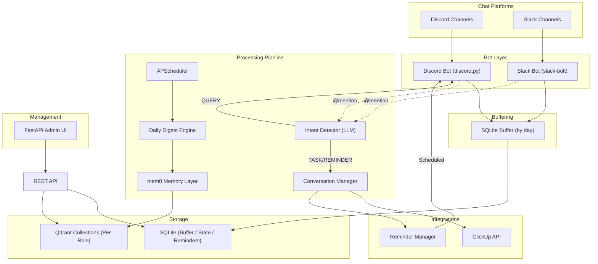

# System Architecture

The TD Games Memory Database System follows a Capture-Buffer-Digest-Retrieve pattern.

## Data Flow Diagram

## Component Roles
1.  **Bot Layer**: Listens to messages and checks for role-specific tagging. Saves messages to the buffer.
2.  **Message Buffer**: A SQLite database that stores raw message data, grouped by date.
3.  **Daily Digest**: A scheduled job that pulls unprocessed messages from the buffer, batches them by channel, and uses an LLM to extract "important info" for the role.
4.  **Memory Engine**: Wraps `mem0` to manage separate Qdrant collections for each role.
5.  **Query Engine**: Handles @mention logic: searches memory -> builds context -> generates role-specific response.
6.  **Intent Detector**: Uses an LLM to classify user @mentions into intents (QUERY, CREATE_TASK, UPDATE_TASK, SET_REMINDER).
7.  **Conversation Manager**: A state machine that handles multi-turn interactions for gathering task or reminder details.
8.  **ClickUp Client**: Async wrapper for ClickUp API v2 used for task operations. Supports auto-provisioning of lists and custom fields.
9.  **Reminder Manager**: Persistence-backed scheduling system for user-requested notifications using `APScheduler`.
10. **Admin UI**: Provides a visual interface to manage the system without SSH.
11. **Multi-Layered Memory Stack**:
    - **Layer A (Session)**: Transient chat history (window-limited).
    - **Layer B (Agent Context)**: File-based persona and persistent standards (SOUL.md, IDENTITY.md, USER.md, MEMORY.md, TOOLS.md). Extracted and injected into every prompt.
    - **Layer C (Long-term)**: Mem0-managed vector search in Qdrant (Search-based retrieval from summarized daily digests).
